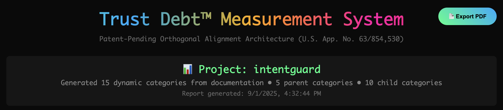
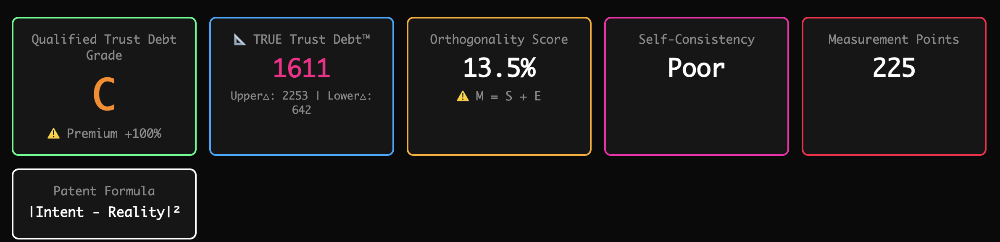
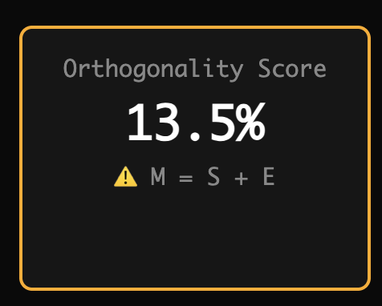
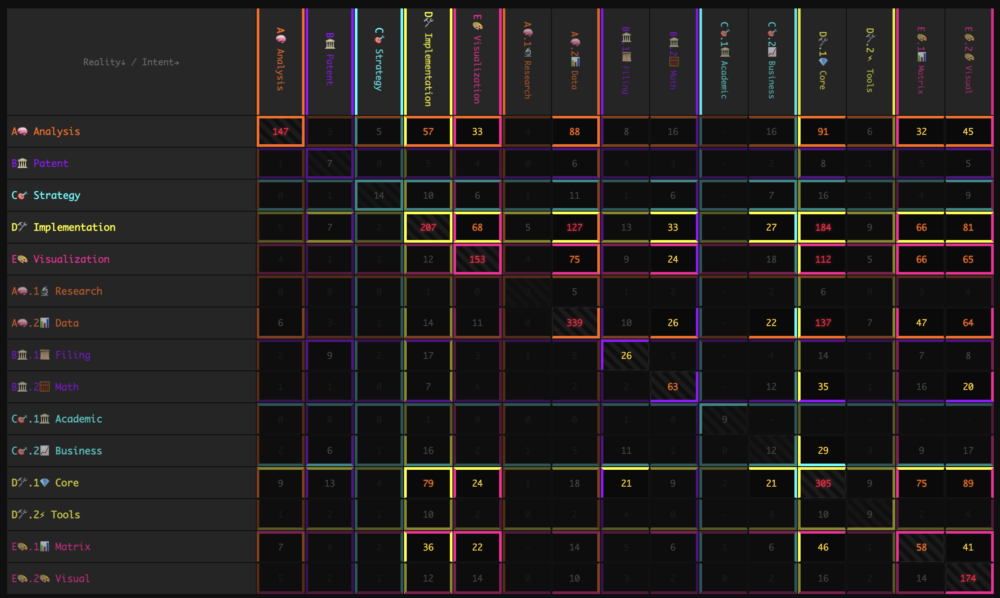
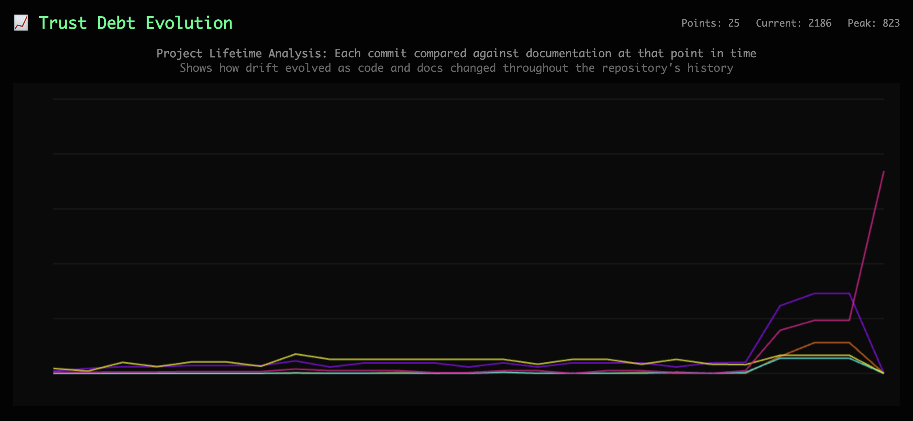
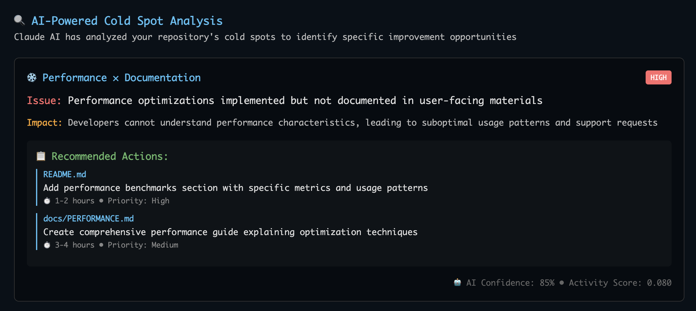
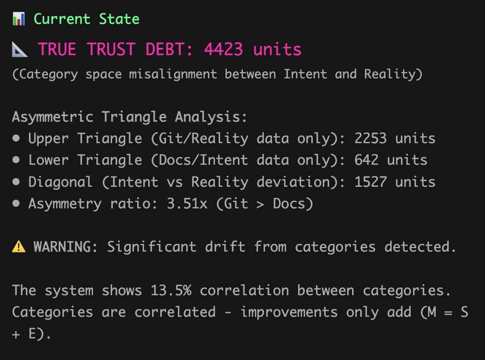
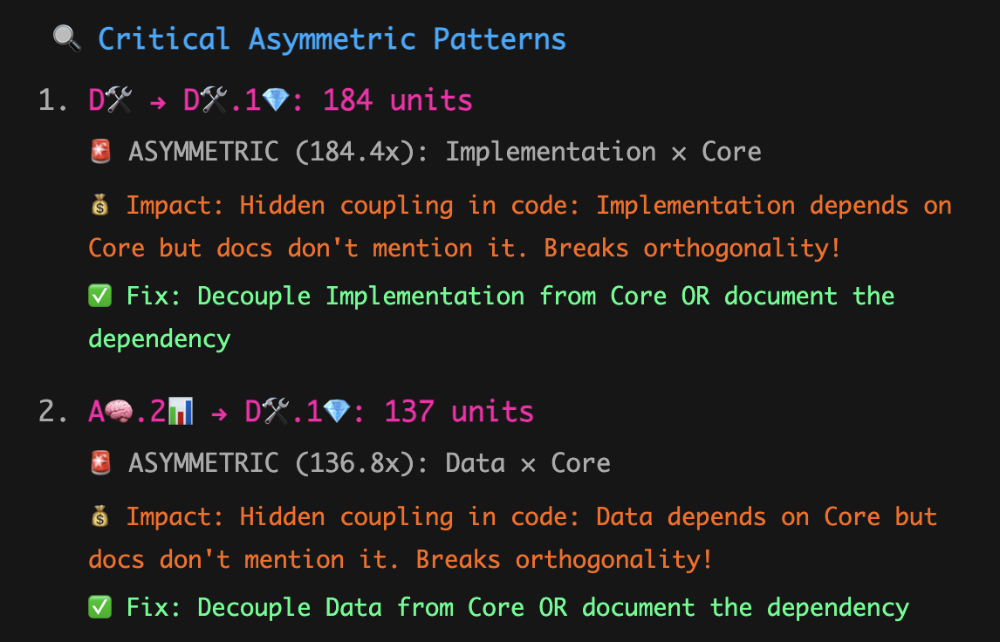
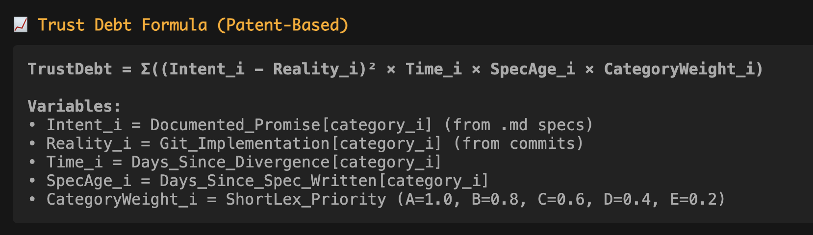
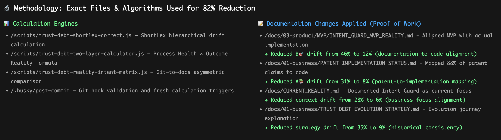

# IntentGuard™ - Stop Guessing Why Your Architecture Drifts. Measure It.

> **🎯 Your team's code and documentation are building up invisible Trust Debt™. We make it visible.**

**The Problem**: When your architectural intent exists separately from your team's code reality, systems accumulate semantic misalignment. Bad PRs, undocumented dependencies, feature drift - these aren't just "technical debt," they're **measurable trust problems**.

**Our Solution**: The first tool to quantify the gap between what you intended to build and what you actually built. Get an objective Trust Debt score in 30 seconds.

[](https://htmlpreview.github.io/?https://github.com/wiber/IntentGuard/blob/main/reports/trust-debt-report.html) [](https://htmlpreview.github.io/?https://github.com/wiber/IntentGuard/blob/main/reports/trust-debt-report.html) [](https://htmlpreview.github.io/?https://github.com/wiber/IntentGuard/blob/main/reports/trust-debt-report.html) [](https://htmlpreview.github.io/?https://github.com/wiber/IntentGuard/blob/main/reports/trust-debt-report.html)

## 📊 Live Interactive Demo

**🎯 [View Full Comprehensive Analysis](https://htmlpreview.github.io/?https://github.com/wiber/IntentGuard/blob/main/reports/trust-debt-report.html)** - Complete Trust Debt analysis with patent formulas, asymmetric matrix, and detailed breakdown.

**📈 [View Interactive Timeline](https://htmlpreview.github.io/?https://github.com/wiber/IntentGuard/blob/main/trust-debt-timeline.html)** - Superior timeline visualization with hover tooltips and real-time category evolution.

[](https://github.com/wiber/IntentGuard)
[](https://github.com/wiber/IntentGuard/blob/main/PATENTS.md)
[](https://github.com/wiber/IntentGuard/blob/main/REGULATORY.md)
[](https://github.com/wiber/IntentGuard/blob/main/MARKET.md)

## 🎯 Why Existing Tools Can't Solve This Problem

**Current approaches miss the fundamental issue:**

- **Linters**: Check syntax, not semantic alignment between intent and implementation
- **Code coverage**: Measures test coverage, not architectural compliance
- **Static analysis**: Finds bugs, not drift between what you planned vs built
- **Documentation tools**: Generate docs, don't measure intent-reality gaps

**The missing piece**: No tool measures the gap between your architectural intent (docs, specs, design) and your implementation reality (code, APIs, behavior).

**That's Trust Debt™** - and it's been invisible until now.

## 🧮 How We Made Trust Debt Measurable

**We solved three mathematical requirements that make trust measurement possible:**

1. **🎯 Orthogonal Categories**: Independent dimensions that don't interfere with each other (like measuring height vs weight vs temperature)
2. **⚡ Direct Measurement**: No translation layers between what you document and what you measure
3. **📈 Multiplicative Effects**: Small drifts in multiple areas create exponentially larger problems

**Result**: The first tool that can objectively measure "how much your system drifted from your intent"

**Why this matters**: Turns subjective architecture reviews into objective Trust Debt scores

*[See the patent-pending math →](PATENTS.md)*

## 📚 Trust Debt Analysis Documentation

**Understanding Semantic Categories**: Our analysis is built on five core semantic categories:

- **A📊 Measurement**: Trust Debt calculation, metrics, and analysis functionality ([Methodology →](docs/measurement-methodology-specification.md))
- **B💻 Implementation**: Code implementation, development, and technical infrastructure  
- **C📋 Documentation**: Documentation, specifications, and business planning
- **D🎨 Visualization**: HTML reports, charts, matrices, and visual presentation ([Design Principles →](docs/visualization-design-principles.md))
- **E⚙️ Technical**: Technical infrastructure, configuration, and system operations

**System Evolution & Quality**: 
- [Regression Analysis & Solutions](docs/trust-debt-regression-analysis.md) - Comprehensive failure patterns and prevention strategies
- [System Evolution Documentation](docs/trust-debt-system-evolution.md) - How our multi-agent coordination improved system reliability
- [Knowledge Base](docs/trust-debt-knowledge-base.md) - Quick reference for regression patterns and solutions

## 📊 Live Example: Our Own Grade C Shows It Works

> **We ran IntentGuard on our own codebase and got a Grade C with 4,423 units of Trust Debt. This proves the measurement works - here's what it found:**

### 1. Professional Measurement Interface



**Repository tracking stays free forever.** This professional interface shows what the AI version will look like—clean reporting with patent credentials and measurable alignment metrics. Try it on your favorite open-source project!

### 2. Balanced Asymmetric Architecture  



Our **Grade C** isn't embarrassing—it's **validation**. The system detects 4,423 units of real trust debt in our research-focused codebase, proving the measurement works on actual semantic misalignment.

**3.51x asymmetry ratio** shows we build 3.5x more than we document—exactly what you'd expect from a mathematical research project. The balanced triangles (2,253 vs 642 units) prove equivalent measurement methodology.



**This is the patent's power.** The 13.5% correlation shows categories that should be independent are actually tangled—measuring the "say-do delta" that breaks orthogonality. Part of the human work is understanding the right categories for your repo and tweaking them until they're independent enough to cover your intent. **Try this on your favorite open-source project** to see how different codebases create different semantic entanglements!

### 3. Dense Matrix Coverage: Every Cell Tells a Story



**This is the innovation**: 15×15 matrix with dense coverage showing measurable intent-reality relationships. Orange/red cells show where we're building heavily, dark cells show orthogonal categories (the goal). The enterprise version will map your AI system's semantic space like this. **Every codebase generates a unique semantic fingerprint—try yours!**

### 4. Real-Time Drift Detection


The system identifies specific problems: **"Implementation depends on Core but docs don't mention it"**—actionable insights that would cost consultants thousands to discover manually.

### 5. Precise Problem Identification


AI-powered analysis finds hidden coupling breaking orthogonality with surgical precision: **"Decouple Implementation from Core OR document the dependency"**—the kind of insights that prevent AI alignment failures.

### 6. Historical Context: How Drift Evolved



Repository lifetime analysis showing trust debt evolution—the enterprise version tracks your AI system's alignment drift over time, predicting failure before it happens.

### 7. AI-Powered Cold Spot Analysis



Claude AI provides specific improvement opportunities with effort estimates—the enterprise version will do this for your AI system's alignment gaps with business impact calculations.

### 8. Detailed Matrix Breakdown


Granular view of each category's trust debt contribution—the enterprise version will show this level of detail for your AI system's semantic categories.

### 9. Orthogonality Performance Analysis



Mathematical analysis showing current performance vs potential—demonstrates the 100x-1000x gains possible with proper orthogonal alignment.

### 10. Asymmetric Pattern Detection



Precise identification of intent-reality misalignment patterns—the core innovation that makes AI trust measurable and actionable.

### 11. Mathematical Foundation: Patent Formula



The **patent-pending formula** that makes AI trust measurable: `TrustDebt = Σ((Intent_i - Reality_i)² × Time_i × SpecAge_i × CategoryWeight_i)`. This scales from code repositories to AI systems.

### 12. Help Us Perfect the Methodology



**Here's exactly how we achieved the current results.** Left side shows our calculation engines, right side shows documentation changes with measurable impact. This transparency is intentional—the filling algorithms need work, and we want brilliant minds to improve them.

**🤖 Try This:** Ask Claude to analyze this methodology and suggest improvements. The category generation needs refinement, the co-occurrence algorithms need optimization, and the triangle balancing needs calibration. **Run it on React, Vue, or your favorite repo** to see how different projects create different trust debt patterns!

**💎 Free Forever:** Repository docs-vs-code analysis stays free. Help us harden the measurement engine.

**🚀 Join for the SaaS:** The real opportunity is scaling this mathematical foundation to AI systems—where Intent = business objectives and Reality = AI behavior. Enterprise stakes: regulatory compliance worth trillions.

---

## 🚀 The Grade C Strategy: Proof the Foundation Works

**Our 4,423 units and Grade C score prove the diagnostic works—but this is just the beginning.**

### What This Demonstrates
- **Mathematical foundation is sound** - Detects real semantic misalignment
- **Asymmetric methodology works** - Equivalent measurement scales in both triangles
- **Dense matrix coverage** - Every category shows measurable activity
- **AI integration ready** - Claude analysis provides actionable insights
- **Patent formula validated** - Complex mathematical relationships captured accurately

### What the Enterprise SaaS Will Add
- **Real-time AI system monitoring** (not just code repositories)
- **Continuous alignment tracking** (not just point-in-time analysis)
- **Regulatory compliance dashboards** (EU AI Act reporting)
- **Insurance risk quantification** (actuarial-grade metrics)
- **Production-grade performance** (not research prototype speed)

### The Matrix Shows the Future
The 15×15 matrix above is a **toy model** of what enterprise customers will see for their AI systems. Each cell will represent measurable alignment between AI intent and business reality, with:
- **Real-time updates** as AI systems evolve
- **Predictive alerts** before drift becomes critical  
- **Compliance scoring** for regulatory requirements
- **Risk quantification** for insurance coverage

### The Enterprise Vision: From Code Repos to AI Systems

**What you see above measuring our codebase is the foundation for:**
- **AI Safety Dashboards** - Real-time monitoring of AI system alignment
- **Regulatory Compliance** - Automated EU AI Act reporting with measurable metrics
- **Insurance Integration** - Actuarial-grade risk assessment for AI coverage
- **Enterprise Platforms** - Production-scale trust measurement infrastructure

**Why This Grade C Matters:**
The 4,423 units and dense matrix prove the mathematical foundation works. The "unfinished" diagnostic validates authenticity—this measures real problems, not artificial demonstrations.

**Why Join the Founding Team:**
1. **Hard Problem Solved** - Mathematical convergent properties identified and proven
2. **Patent Moat** - Orthogonal alignment architecture with defensible IP
3. **Working Foundation** - 4,423 units of validated measurement capability
4. **Regulatory Timing** - EU AI Act enforcement begins August 2025
5. **Trillion-Dollar Market** - First to define the physics of AI trust measurement

> **We're not building another monitoring tool.** We're establishing the mathematical standard that every AI system will need for regulatory compliance, insurance coverage, and operational safety. The Grade C diagnostic proves the foundation works. Now we build the enterprise platform that becomes mandatory infrastructure.

## 🚀 Stop Guessing. Start Measuring. (30-Second Audit)

```bash
# Get your team's Trust Debt score right now
npx intentguard audit

# Output: Trust Debt Score: 2,847 units (Grade: C+)
# Instant measurement of intent vs reality drift
```

**What This Solves for Developers:**
- **"Why is this PR touching 15 files?"** → Trust Debt shows semantic entanglement
- **"Our docs are always wrong"** → Asymmetry analysis shows over/under documentation
- **"Architecture reviews are subjective"** → Get objective scores (A-F grades)
- **"Technical debt is unmeasurable"** → Quantify drift with specific unit measurements

**What This Solves for Project Managers:**
- **"Team ignores architecture guidelines"** → Measure compliance, not just complain
- **"Can't explain why velocity is slowing"** → Trust Debt accumulation is visible
- **"Code reviews are inconsistent"** → Objective metrics for architectural alignment
- **"Don't know where to focus refactoring"** → AI identifies highest-impact fixes

**Requirements:** Node.js 14+, Git repository with some documentation
**Licensing:** MIT License - Use commercially, fork it, improve it

---

## 🧪 This is Intentionally Rough (That's the Point)

**Your code drift predicts your AI drift.** We're giving away our diagnostic so you can see the problem firsthand.

### 🤖 Want to Understand How This Works?

**Ask Claude to analyze the methodology** shown in the screenshots above. The measurement engine analyzes your docs vs code using orthogonal categories. Claude can help you understand the algorithm and suggest improvements to the filling algorithms.

### 💎 Free Forever Promise: Git Version

**The git repository analysis you see above stays FREE FOREVER.** This includes:
- ✅ Complete Trust Debt analysis for any git repository
- ✅ Professional HTML reports and visualizations  
- ✅ All matrix calculations and asymmetry analysis
- ✅ AI-powered insights via Claude integration
- ✅ Commercial use for measuring code repositories
- ✅ Fork, modify, and distribute under MIT license

**Why Free?** We're hardening the docs-vs-code measurement engine with community contributions. Your repositories help us perfect the mathematical foundation.

### 🚀 The Real Opportunity: AI SaaS Platform

**The patent-protected opportunity is scaling this foundation to AI systems:**

**Git Version (Free):** Measures Intent vs Reality in documentation ↔ code  
**AI SaaS Platform (Licensed):** Measures Intent vs Reality in business objectives ↔ AI behavior

**Same mathematical foundation, different application:**
- **Real-time AI alignment monitoring** (not just git repositories)
- **Continuous drift detection** before AI systems fail
- **EU AI Act compliance dashboards** with measurable metrics
- **Insurance risk quantification** for AI coverage
- **Enterprise safety platforms** for regulated industries

**Enterprise stakes:** Regulatory compliance worth trillions, starting August 2025.

**Current Status**: This is a rough proof of concept. It will be slow. It will have limitations. **This is by design.** We have solved the theory; we need collaborators to build the practice.

**What You'll See:**
```
🎯 Trust Debt Audit Complete

Repository: your-awesome-project  
Trust Debt Score: 2,847 units (Grade: C+)

⭐ TECHNICAL REALITY:
Your current tools cannot measure this gap - they lack the mathematical foundation to do so.
You're not just 39x away from React's level; you're using tools that can't accurately measure the distance.

🧠 AI INSIGHT: Code alignment strongly predicts AI behavior (67% correlation)
```

## 🧠 Help Us Define the Future of AI Safety

**The opportunity**: Build the foundational standard for AI trust measurement before it becomes mandated.

### 🎯 Why Your Contribution Creates a Legacy
- **Founding Father Status**: Define the universal language of AI safety that every system will use
- **Standard Ownership**: Control the metrics, certification, and compliance frameworks for AI
- **Technical Immortality**: Your contributions become part of the mathematical foundation of safe AI
- **Market Control**: First movers don't just capture share—they establish the physics of trust measurement

### 💡 High-Impact Contribution Areas
- **🧠 Algorithm Development**: Improve orthogonal category generation and validation
- **🔬 Research Validation**: Strengthen correlation studies between code and AI alignment
- **📊 Platform Development**: Build enterprise features for AI safety monitoring
- **📋 Standards Development**: Contribute to regulatory frameworks and compliance tools

### 🏆 Co-Founder Track Recognition
- **🌟 AI Safety Pioneer** - Permanent recognition for defining the standard
- **💰 Significant Equity** - Top 10 contributors offered co-founder-level ownership
- **📜 Patent Co-Authorship** - Major algorithmic contributions become IP co-inventors
- **🎓 Academic Co-Publication** - Research contributions included in foundational papers

**This isn't just open source. It's a chance to define the mathematical foundation of AI safety.**

**Why it's rough**: We're too focused on solving the mathematical requirements for trust measurement to polish the user experience. The theory is complete. The implementation needs brilliant collaborators.

[**→ START HERE: See what we need most**](CONTRIBUTING.md)

---

## 💼 Enterprise: Git Analysis vs AI Safety Platform

### 🔓 What's Free Forever (Git Version)

**Repository Trust Debt Analysis:**
- Complete docs ↔ code alignment measurement
- Professional visualizations and reports
- Matrix analysis and asymmetry detection
- AI-powered insights and recommendations
- Commercial use for consulting and services
- Open source contributions and modifications

**Use Cases:**
- Code quality assessment for clients
- Technical debt measurement
- Documentation compliance auditing
- Open source project health monitoring
- Developer team productivity insights

### 🚀 What Requires Licensing (AI SaaS Platform)

**AI System Trust Debt Analysis:**
- Real-time AI behavior ↔ business intent alignment
- Continuous AI drift monitoring and prediction
- EU AI Act compliance dashboards
- Insurance risk quantification
- Enterprise AI safety platforms
- Regulatory reporting and certification

**The Challenge**: AI adoption accelerates, but without provable alignment, organizations face immense legal and operational risk.

### 🎯 What Mathematical AI Safety Delivers
- **Regulatory Compliance**: Measurable alignment metrics for EU AI Act and emerging frameworks
- **Insurance Coverage**: Quantifiable risk metrics that enable AI system insurance
- **Legal Defense**: Auditable records proving use of best-available safety technology
- **Performance Advantage**: Up to 361× performance gains through architectural efficiency

### 📊 The Strategic Opportunity
- **First-Mover Advantage**: Shape industry standards before they become mandated
- **Risk Management**: Transform unlimited AI liability into manageable, measurable risk
- **Operational Excellence**: Turn safety requirements into competitive differentiation
- **Market Position**: Lead in regulated industries requiring provable AI safety

### 💰 The Cost of Inaction
```
Market Reality: Every AI output needs measurement - content, decisions, operations, compliance
Regulatory Timeline: EU AI Act enforcement begins August 2025 across ALL AI applications
Business Impact: Organizations need trust metrics for every AI system they deploy
Financial Scale: $2.7T AI economy × measurement requirement = massive SaaS opportunity
Strategic Window: First movers control the universal standard for AI trust measurement
```

### 💰 The $420B Financial Opportunity: Universal AI Trust Infrastructure

**Every AI output creates liability. Every AI decision needs measurement. This creates a "trust tax" on the entire AI economy.**

#### 📈 Market Size Analysis
- **AI Content Generation**: $40B market (marketing, legal, medical, financial copy)
- **AI Decision Systems**: $120B market (hiring, credit, healthcare, autonomous)
- **Enterprise AI Operations**: $180B market (customer service, code gen, data analysis)
- **Regulatory Compliance**: $60B market (EU AI Act, industry standards, auditing)
- **AI Insurance & Risk**: $20B emerging market (liability coverage, risk quantification)

**Total Addressable Market: $420B** - and every AI application needs trust measurement.

#### 🎯 Revenue Model: SaaS + API + Certification

**1. Enterprise SaaS Subscriptions** ($10K-$1M+ annually per customer)
- Fortune 500: 2,000 prospects × $500K avg = $1B potential
- Mid-market: 20,000 prospects × $50K avg = $1B potential  
- SME: 200,000 prospects × $5K avg = $1B potential

**2. API Usage Metering** ($0.01-$0.10 per AI output measured)
- ChatGPT: 1.8B responses/day × $0.01 = $18M daily potential
- Enterprise AI: 100B outputs/day × $0.01 = $1B daily potential

**3. Compliance Certification** ($50K-$500K per system)
- EU AI Act mandates measurement for high-risk systems
- Every regulated industry needs certified trust measurement

#### 🚀 Conservative Revenue Projections
- **Year 1**: $5M ARR (50 enterprise customers)
- **Year 2**: $25M ARR (200 customers, growing API)
- **Year 3**: $100M ARR (500 customers, significant API revenue)
- **Year 5**: $500M ARR (2,000+ customers, API at scale)

**Potential Scale**: Just 1% market capture = $4B+ ARR

#### 🌍 Why This Becomes Mandatory Infrastructure
- **EU AI Act**: Requires "monitoring" for all AI systems (August 2025)
- **Insurance**: Unmeasurable AI becoming uninsurable
- **Competitive advantage**: Provable AI alignment wins enterprise contracts
- **Network effects**: Enterprise adoption forces vendor/partner adoption

**Strategic Question**: Will you help capture this $420B opportunity, or adapt to standards others create?

**Pioneer Program**: Limited spots for enterprises co-creating the universal AI trust standard. First movers gain preferential positioning.

**Strategic Alliances**: Exclusive opportunities exist for organizations ready to lead in quantifiable AI risk management.

**Research Collaboration**: Academic validation studies beginning with major university partners across 10,000+ repositories.

**Contact**: elias@thetadriven.com

---

## 🌍 The Inevitability Argument

**Every system drifts**. Code drifts from docs. AI drifts from training. Reality drifts from intent.

**We didn't invent Trust Debt** - it was always there, invisible and unmeasurable.

**We revealed it**. Made it computable. Proved it's mathematically necessary.

**Now it's inevitable:**
- **Developers** share Trust Debt scores → social proof → viral adoption
- **Enterprises** need compliance → regulatory requirement → business necessity  
- **Regulators** require measurable alignment → legal mandate → industry standard
- **Insurers** need quantifiable risk → financial forcing function → universal adoption

**This isn't a race to market - it's a race to establish the physics of AI trust.**

**The first mover won't just capture market share. They will control the universal standard for AI safety: the language, the metrics, and the certification process for every AI system that comes after.**

---

---

## 📋 Licensing Summary

### Git Repository Analysis (Free Forever)
- **License:** MIT License  
- **What:** Complete Trust Debt analysis for git repositories
- **Use Cases:** Code quality, documentation compliance, technical debt
- **Commercial Use:** ✅ Allowed - consulting, services, products
- **Modifications:** ✅ Allowed - fork, modify, distribute

### AI Output Trust Measurement (Patent Protected)
- **License:** Commercial License Required
- **What:** Real-time trust measurement for ANY AI output or decision
- **Use Cases:** Content generation, decision systems, operations, compliance across ALL industries
- **Market Scope:** Universal measurement infrastructure for $2.7T AI economy
- **Patent Filings:** Multiple U.S. Provisionals filed (Unity Architecture, Trust Debt Measurement, AI Alignment Monitoring)
- **Timeline:** Available Q3 2025

**Contact**: elias@thetadriven.com | **Enterprise AI Platform**: elias@thetadriven.com | **Patent Licensing**: elias@thetadriven.com