# IntentGuard Trust Debt Analysis - System Architecture Overview

## 🎯 Executive Summary

This document outlines a comprehensive development plan to enhance IntentGuard's Trust Debt analysis capabilities through modular architecture improvements, new features, and advanced integrations. The plan focuses on transforming the current research-grade prototype into a production-ready enterprise platform.

## 📊 Current State Analysis

### Existing Architecture Components
- **Core Trust Debt Engine** (`src/trust-debt.js`) - Basic intent vs reality measurement
- **Matrix Calculation System** - 15x15 category matrix with asymmetric analysis  
- **HTML Report Generation** - Comprehensive visualization and reporting
- **CLI Interface** (`bin/cli.js`) - Command-line analysis tools
- **Git Integration** - Commit history and timeline analysis
- **Category Generation** - Dynamic orthogonal category creation

### Key Strengths
- ✅ Patent-pending mathematical foundation for Trust Debt measurement
- ✅ Working asymmetric matrix analysis (Intent ↔ Reality drift detection)
- ✅ Dense matrix coverage with 15x15 categorical relationships
- ✅ Historical timeline tracking with commit-based analysis
- ✅ AI-powered cold spot analysis and recommendations
- ✅ Professional HTML reporting with visual dashboards

### Identified Gaps
- ❌ Limited API surface for external integrations
- ❌ No real-time analysis capabilities
- ❌ Missing CI/CD pipeline integration
- ❌ Limited scalability for large repositories
- ❌ No web dashboard or SaaS platform capabilities
- ❌ Basic security and authentication
- ❌ Manual category optimization process

## 🏗️ Enhanced System Architecture

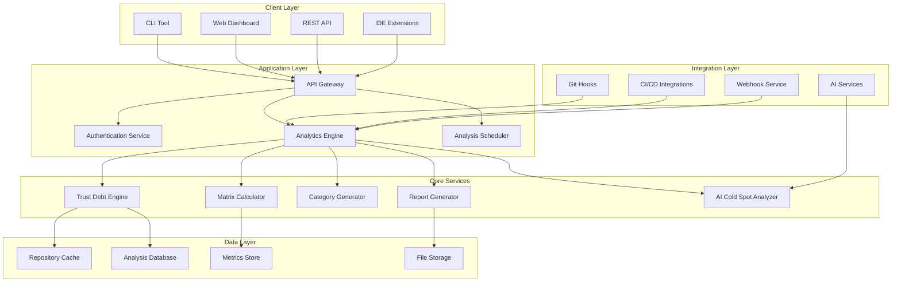

## 🔧 Core Service Architecture

### Trust Debt Engine (Enhanced)
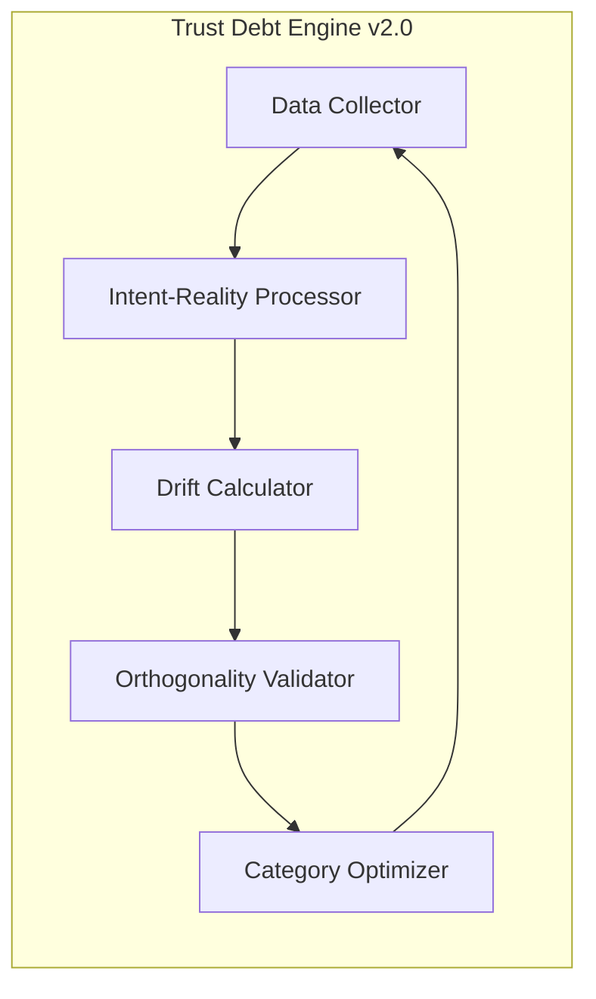

**Key Enhancements:**
- Real-time processing capabilities
- Streaming analysis for large repositories
- Auto-optimization of orthogonal categories
- Parallel processing for multiple repositories
- Advanced drift prediction algorithms

### Matrix Calculation System v2.0
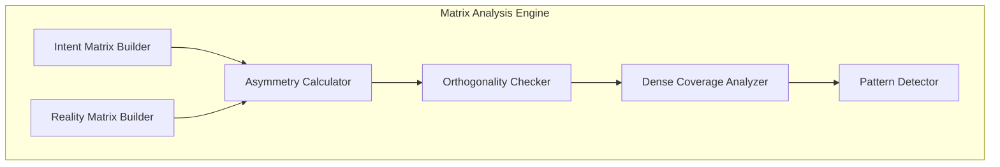

**Innovations:**
- Dynamic matrix sizing (15x15 to NxN)
- Real-time asymmetry detection
- Pattern recognition for drift prediction
- Automated orthogonality optimization
- Performance benchmarking against industry standards

## 🚀 New Feature Architecture

### 1. Real-Time Analysis Engine
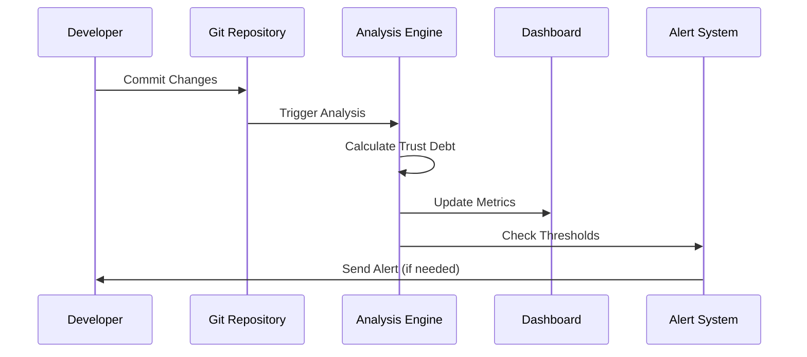

### 2. AI-Powered Enhancement Suite
- **Advanced Cold Spot Analysis** - Claude integration for deeper insights
- **Predictive Drift Modeling** - ML models for future Trust Debt prediction  
- **Auto-Category Optimization** - AI-driven orthogonal category refinement
- **Semantic Similarity Analysis** - Enhanced intent-reality matching

### 3. Enterprise Integration Platform
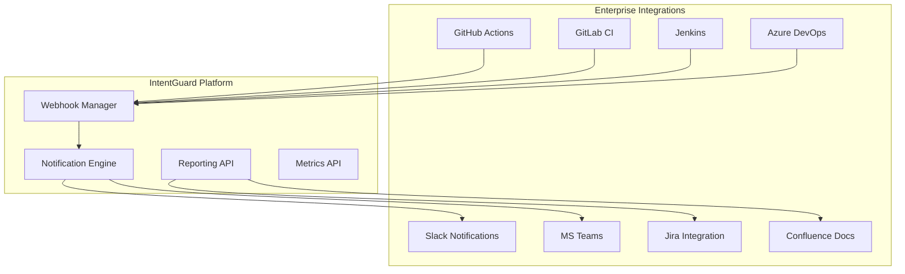

## 📊 Data Architecture

### Database Schema Design
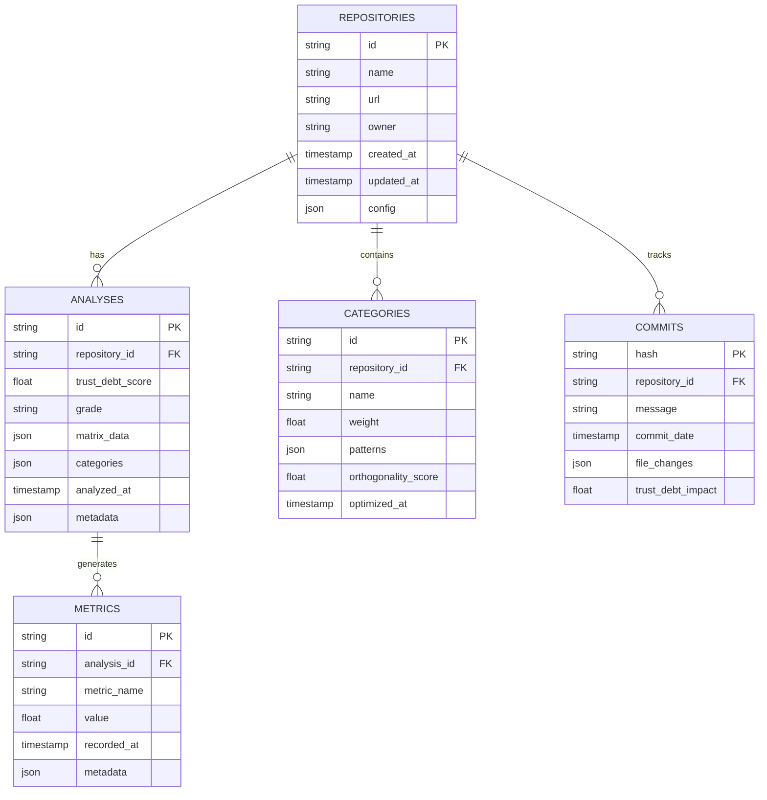

### Caching Strategy
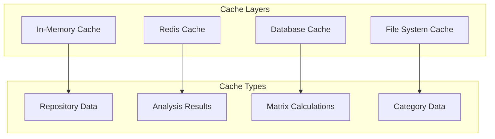

## 🔐 Security Architecture

### Authentication & Authorization
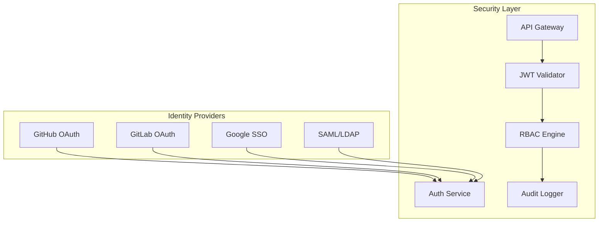

**Security Features:**
- OAuth integration with major Git platforms
- Role-based access control (RBAC)
- JWT token-based authentication
- API rate limiting and throttling
- Audit logging for all operations
- Data encryption at rest and in transit

## 📈 Performance & Scalability Architecture

### Horizontal Scaling Design
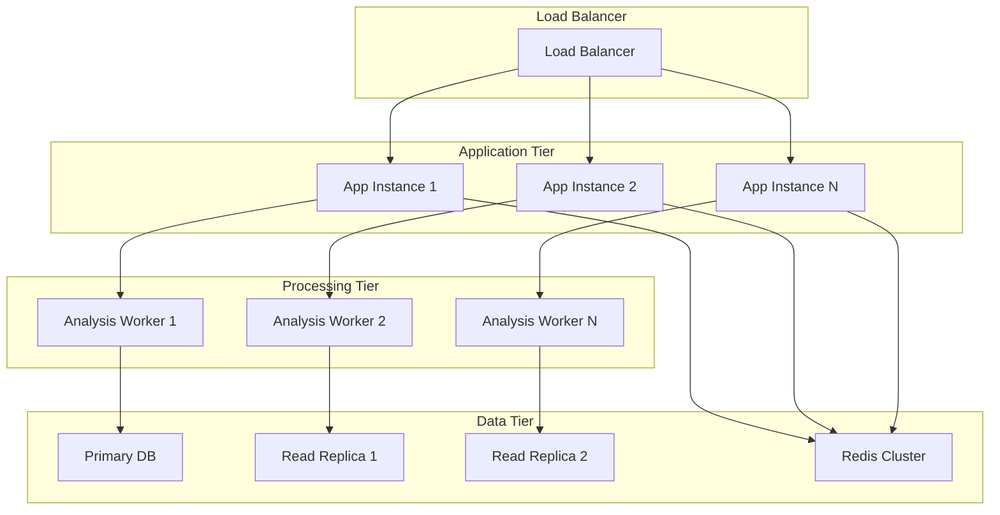

**Performance Targets:**
- **Analysis Speed**: < 30 seconds for repositories up to 100MB
- **API Response Time**: < 200ms for cached results
- **Concurrent Users**: Support 1000+ concurrent analyses
- **Throughput**: 100+ repositories analyzed per minute
- **Availability**: 99.9% uptime SLA

## 🌐 Deployment Architecture

### Multi-Environment Strategy
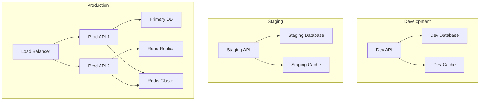

**Infrastructure Requirements:**
- **Development**: Single instance, SQLite, local Redis
- **Staging**: 2 instances, PostgreSQL, Redis cluster
- **Production**: Auto-scaling (2-10 instances), PostgreSQL cluster, Redis cluster

## 🔄 CI/CD Integration Architecture

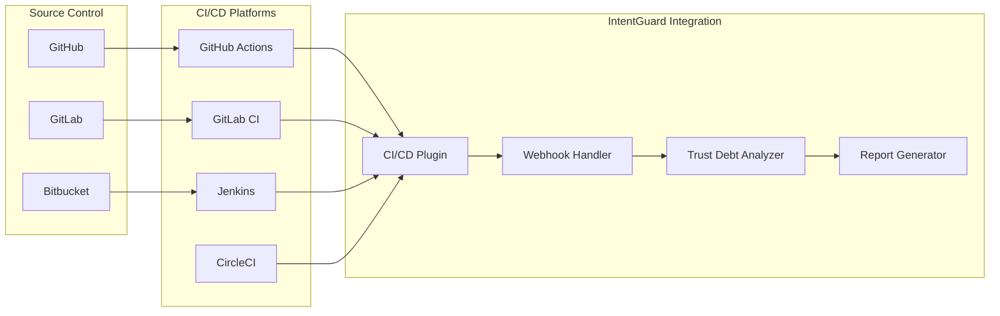

**Integration Features:**
- Pre-commit hooks for real-time analysis
- Pull request status checks
- Build failure on critical Trust Debt thresholds
- Automated reports in PR comments
- Trend analysis in build summaries

## 📋 Technology Stack

### Core Technologies
- **Backend**: Node.js 18+ with TypeScript
- **Database**: PostgreSQL 14+ with TimescaleDB extension
- **Cache**: Redis 7+ with clustering
- **Message Queue**: Redis + Bull Queue
- **API Framework**: Express.js with OpenAPI 3.0
- **Authentication**: Passport.js with OAuth strategies

### Development Tools
- **Testing**: Jest with supertest for API testing
- **Documentation**: OpenAPI/Swagger with automated generation  
- **Monitoring**: Prometheus + Grafana
- **Logging**: Winston with structured JSON logging
- **CI/CD**: GitHub Actions with automated testing and deployment

### AI/ML Integration
- **AI Analysis**: OpenAI GPT-4 or Claude API integration
- **ML Pipeline**: TensorFlow.js for client-side predictions
- **Data Processing**: Apache Arrow for high-performance data handling
- **Vector Search**: PostgreSQL with pgvector extension

## 🎯 Success Metrics

### Technical Metrics
- **Performance**: 95% of analyses complete in < 30 seconds
- **Accuracy**: Trust Debt measurements within 5% variance
- **Reliability**: 99.9% API uptime
- **Scalability**: Support 10,000+ repositories without degradation

### Business Metrics  
- **Adoption**: 1,000+ repositories analyzed in first month
- **Engagement**: 70%+ monthly active users
- **Retention**: 80%+ user retention after 3 months
- **Integration**: 50%+ users enable CI/CD integration

### Quality Metrics
- **Code Coverage**: > 90% test coverage
- **Security**: Zero critical vulnerabilities
- **Documentation**: 100% API endpoint documentation
- **Performance**: < 100ms median API response time

---

This architecture overview provides the foundation for transforming IntentGuard from a research prototype into an enterprise-grade Trust Debt analysis platform. The modular design ensures scalability, maintainability, and extensibility while preserving the core mathematical innovations that make Trust Debt measurement possible.