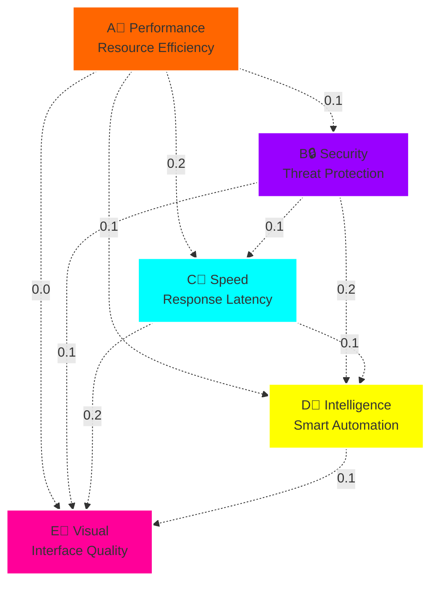
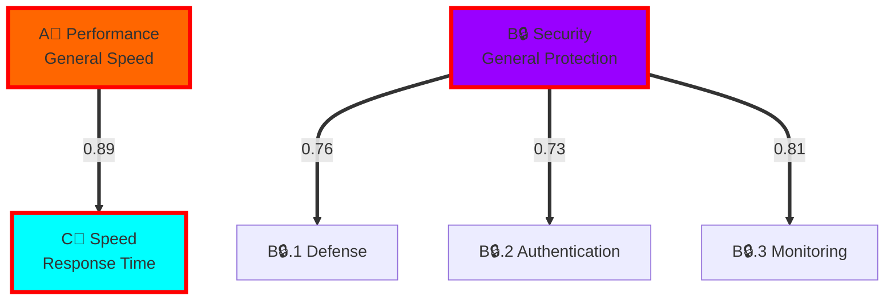
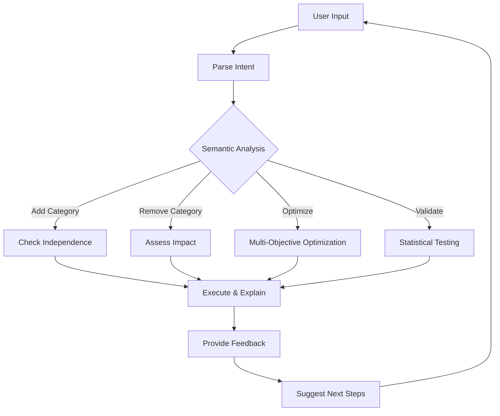
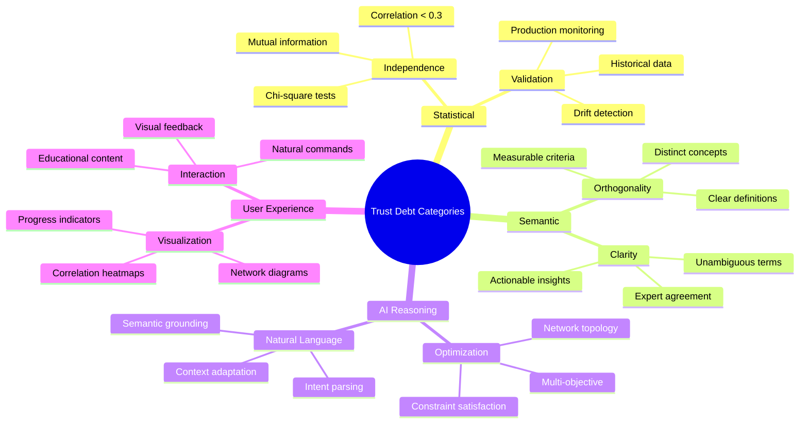

# 🎨 Trust Debt Category Visualization Guide

## Visual Understanding of Statistical Independence and Semantic Networks

### Abstract

This guide provides **visual representations** of Trust Debt category relationships, helping users understand **statistical independence**, **semantic networks**, and **optimization processes** through diagrams, charts, and interactive examples.

---

## 📊 **Understanding Independence Through Visuals**

### Correlation Matrix Heatmaps

#### **Good Independence** (Target State)
```
     A🚀  B🔒  C💨  D🧠  E🎨
A🚀 [1.0][0.1][0.2][0.1][0.0]
B🔒 [0.1][1.0][0.1][0.2][0.1]  
C💨 [0.2][0.1][1.0][0.1][0.2]
D🧠 [0.1][0.2][0.1][1.0][0.1]
E🎨 [0.0][0.1][0.2][0.1][1.0]

🟢 Green: |r| < 0.3 (Independent)
🟡 Yellow: 0.3 ≤ |r| < 0.5 (Moderate)  
🔴 Red: |r| ≥ 0.5 (Correlated)

Result: All off-diagonal elements are green ✅
```

#### **Problematic Correlations** (Before Optimization)
```
     A🚀  B🔒  C💨  D🧠  E🎨
A🚀 [1.0][0.1][0.9][0.1][0.0]  ← 🔴 HIGH CORRELATION!
B🔒 [0.1][1.0][0.1][0.2][0.1]
C💨 [0.9][0.1][1.0][0.1][0.2]  ← 🔴 REDUNDANCY!
D🧠 [0.1][0.2][0.1][1.0][0.1]
E🎨 [0.0][0.1][0.2][0.1][1.0]

Problem: A🚀 (Performance) and C💨 (Speed) are too similar
Solution: Refine definitions or merge categories
```

### Trust Debt Timeline Visualization

#### **Independent Categories** (Healthy Pattern)
```
Trust Debt Over Time:

Performance █████████████░░░░░░░░░░  (varying independently)
Security   ░░░░░████████████░░░░░░░  (different pattern)
Speed      ░░░░░░░░░████████████░░░  (distinct from Performance)
Intelligence ████░░░░░░░░░░░░█████░░  (unique variations)
Visual     ░░███████░░░░░░░░░░░████  (orthogonal changes)

✅ Each category shows distinct patterns
✅ No synchronized movements
✅ Independent variation indicates good design
```

#### **Correlated Categories** (Problem Pattern)
```
Trust Debt Over Time:

Performance ████████████░░░░░░░░░░
Speed       ████████████░░░░░░░░░░  ← Same pattern as Performance!
Security    ░░░░░████████████░░░░░
Intelligence ░░░░░████████████░░░░░  ← Follows Security pattern!
Visual      ░░███████░░░░░░░░░████

❌ Performance and Speed move together (correlation)
❌ Security and Intelligence show synchronized changes
🔧 Action: Refine category definitions for independence
```

---

## 🕸️ **Semantic Network Diagrams**

### Network Topology Patterns

#### **Optimal Topology: Minimal Connections**


#### **Problematic Topology: Strong Connections**


### Optimization Process Visualization

#### **Before → After Transformation**
```
BEFORE (Problematic Network):
    Performance ←→ Speed (r=0.89)
         ↑           ↑
    [Too similar concepts]

AFTER (Optimized Network):  
    Computational ⊥ Response
    Efficiency      Latency
         ↑           ↑
    [Orthogonal concepts]

Transformation Process:
1. 🔍 Detect high correlation
2. 🧠 Analyze semantic overlap  
3. ✂️ Factor out common elements
4. 🔧 Refine definitions
5. ✅ Validate independence
```

---

## 📈 **Interactive Visualization Examples**

### Category Relationship Explorer

#### **3D Independence Space**
```
Imagine a 3D scatter plot where:
- X-axis: Semantic Similarity (0-1)
- Y-axis: Statistical Correlation (-1 to 1)  
- Z-axis: Domain Coverage Contribution (0-1)

Target Region (Good Categories):
- Low semantic similarity (X < 0.3)
- Low statistical correlation (|Y| < 0.3)
- High coverage contribution (Z > 0.6)

Problem Categories:
- High semantic similarity + High correlation → Redundant
- Low coverage contribution → Not useful
- High correlation despite low semantic similarity → Measurement issue
```

#### **Dynamic Network Visualization**
```
Real-time network that updates as you modify categories:

[Add Category] → Network expands, shows new connections
[Remove Category] → Network contracts, redistributes connections
[Optimize] → Network reorganizes to minimize correlation edges
[Validate] → Network highlights problem areas in red

Interactive Features:
- Hover over nodes → See category details and measurements
- Click edges → View correlation strength and trend over time
- Drag nodes → Manually test different arrangements
- Filter view → Show only problematic relationships
```

### Optimization Algorithm Visualization

#### **Simulated Annealing Process**
```
Temperature Timeline:
Hot  🔥████████████░░░░░░░░░░ Cold ❄️
      ^                      ^
   Random exploration    Local optimization
   
Category Ordering Quality:
Poor ░░░░████████████████████ Excellent
     ^                      ^
  Initial state           Final optimized state
  
Process Visualization:
1. Start hot: Accept many changes (explore space)
2. Cool down: Become selective (refine solution)
3. Freeze: Lock in optimal arrangement
```

#### **Genetic Algorithm Evolution**
```
Generation 1: Random category orderings
[A,B,C,D,E] [B,E,A,C,D] [C,A,D,B,E] [E,D,C,A,B] ...

Generation 50: Evolved optimizations  
[A,E,B,D,C] [E,A,D,B,C] [A,D,E,B,C] [E,B,A,D,C] ...
     ↑           ↑           ↑           ↑
   Fitness:    92%        89%        91%        88%

Selection Pressure → Convergence to optimal arrangements
```

---

## 🎯 **User Interface Design Patterns**

### Natural Language Interface Visualization

#### **Conversation Flow Diagram**


#### **Progressive Disclosure Pattern**
```
Level 1: Simple Response
"✅ Added 'Testing Quality' category"

Level 2: With Explanation (if requested)  
"✅ Added 'Testing Quality' category
📊 Independence Score: 0.87 (good separation from existing categories)
🎯 Measures: test coverage, assertion quality, mock effectiveness"

Level 3: With Full Analysis (if requested)
"✅ Added 'Testing Quality' category  
📊 Statistical Analysis:
   • Correlation with Security: 0.12 (independent)
   • Correlation with Performance: 0.08 (independent)
   • Predicted orthogonality: 0.91 (excellent)
🔬 Semantic Analysis:
   • Unique measurement focus: verification and validation
   • Distinct from quality assurance (focuses on test implementation)
   • Clear actionability: improve test suite, add missing tests
💡 Next Steps: Run full validation with 'validate_category_system'"
```

### Visual Feedback Patterns

#### **Progress Indicators**
```
Category Optimization Progress:

Independence Score: [████████░░] 80%
Coverage Score:     [██████████] 100%  
Clarity Score:      [█████████░] 90%
Overall Health:     [████████░░] 83%

✅ Independence: Good (target: >80%)
✅ Coverage: Excellent  
✅ Clarity: Excellent
🎯 Overall: Good (target achieved)
```

#### **Problem Visualization**
```
⚠️  Issues Detected:

Performance ←──(0.73)──→ Speed
    │                    │
    ▼                    ▼
[High Correlation Detected]

Recommended Actions:
1. 🔧 Refine definitions to focus on distinct aspects
2. ✂️  Split common concept into separate category
3. 🔄 Re-run optimization with refined definitions
```

---

## 🧠 **Cognitive Load Reduction Strategies**

### Simplifying Complex Concepts

#### **Statistical Independence → Simple Analogies**
```
🎯 Instead of: "Correlation coefficient of 0.89 indicates statistical dependence"
💡 Say: "These categories measure almost the same thing - like having two speedometers in your car"

🎯 Instead of: "Chi-square test p-value < 0.05 rejects null hypothesis"  
💡 Say: "The independence test failed - these categories are too connected"

🎯 Instead of: "Mutual information exceeds threshold"
💡 Say: "These categories share too much information - they overlap"
```

#### **Semantic Networks → Familiar Metaphors**
```
🕸️  Semantic Network = Social Network
- Categories = People  
- Relationships = Friendships
- Independence = People with different interests
- Optimization = Introducing people with complementary skills

🎨 Category Design = Interior Design
- Categories = Room functions
- Independence = Rooms serve different purposes  
- Optimization = Arranging rooms to avoid overlap
- Coverage = Having all necessary rooms
```

### Progressive Complexity Introduction

#### **Beginner Level: Basic Concepts**
- Categories measure different things
- Independence = no overlap
- Use natural language to manage categories

#### **Intermediate Level: Practical Skills**
- Interpret correlation results
- Recognize semantic overlap
- Use optimization tools effectively

#### **Advanced Level: Design Principles**
- Understand statistical methods
- Design domain-specific networks
- Balance competing objectives

---

## 🔄 **Animation and Interactive Elements**

### Conceptual Animations

#### **Independence Breaking Down**
```
Animation: Category Correlation Over Time

Frame 1: Two independent circles
○ Performance    ○ Speed
   (r = 0.1)

Frame 5: Circles start overlapping  
◐ Performance   ◑ Speed
   (r = 0.4)

Frame 10: Heavy overlap
◉ Performance/Speed
   (r = 0.8)

Message: "Correlation detected! Time to refine definitions"
```

#### **Optimization Process**
```
Animation: Shortlex Optimization

Initial Random Order:
[E] → [A] → [C] → [B] → [D]
Quality Score: 0.45

Optimization Steps:
[A] → [E] → [B] → [D] → [C]  (Step 1: +0.12)
[A] → [B] → [E] → [D] → [C]  (Step 2: +0.08)  
[A] → [B] → [D] → [E] → [C]  (Step 3: +0.05)

Final Optimized Order:
[A] → [B] → [D] → [E] → [C]
Quality Score: 0.89 ✅

Message: "Optimization improved quality by 98%!"
```

### Interactive Exploration Tools

#### **Category Relationship Explorer**
```html
<div class="category-explorer">
  <div class="category-nodes">
    <div class="node performance" data-correlations="[0.1,0.2,0.1,0.0]">
      A🚀 Performance
    </div>
    <!-- Click to see correlations with all other categories -->
  </div>
  
  <div class="correlation-display">
    <!-- Real-time correlation visualization -->
  </div>
  
  <div class="independence-score">
    Overall Independence: 87% ✅
  </div>
</div>
```

#### **"What If" Scenario Builder**
```
Interactive Tool: "What happens if I..."

Scenarios:
□ "Add a category for testing"
  → Predicted correlation: 0.15 with all existing ✅
  → Coverage improvement: +12%
  → Recommended: Yes

□ "Remove the Security category"  
  → Coverage loss: -18%
  → Independence change: +3% (slight improvement)
  → Recommended: No (coverage too important)

□ "Merge Performance and Speed"
  → New combined category correlation: 0.0 with others ✅
  → Coverage change: -5% (acceptable)
  → Recommended: Yes (eliminates redundancy)
```

---

## 🎨 **Design Patterns for Visual Communication**

### Color Coding Standards

#### **Correlation Strength**
```css
.correlation-none     { color: #00ff00; } /* r < 0.1  - Independent */
.correlation-weak     { color: #88ff00; } /* r < 0.3  - Acceptable */  
.correlation-moderate { color: #ffff00; } /* r < 0.5  - Caution */
.correlation-strong   { color: #ff8800; } /* r < 0.7  - Problem */
.correlation-very     { color: #ff0000; } /* r ≥ 0.7  - Critical */
```

#### **Category Health Status**
```css
.health-excellent { border: 3px solid #00ff00; } /* 90-100 */
.health-good      { border: 3px solid #88ff00; } /* 80-89 */
.health-fair      { border: 3px solid #ffff00; } /* 70-79 */
.health-poor      { border: 3px solid #ff8800; } /* 60-69 */
.health-critical  { border: 3px solid #ff0000; } /* < 60 */
```

### Icon Language

#### **Category Type Icons**
```
🚀 Performance/Efficiency categories
🔒 Security/Protection categories  
💨 Speed/Latency categories
🧠 Intelligence/AI categories
🎨 Visual/UI categories
🔧 Technical/Infrastructure categories
📊 Analytics/Measurement categories
```

#### **Relationship Type Icons**  
```
⟷ Strong correlation (problematic)
↔ Moderate relationship (monitor)
⋯ Weak connection (acceptable)
⊥ Orthogonal/Independent (ideal)
→ Causal relationship (temporal)
≈ Semantic similarity (conceptual)
```

#### **Action Icons**
```
✅ Validation passed
⚠️  Attention needed  
❌ Problem detected
🔧 Fix recommended
📈 Improvement possible
🎯 Optimization target
```

---

## 📊 **Dashboard Layouts**

### Category Health Dashboard

#### **Main Overview Panel**
```
╔══════════════════════════════════════════════════════════════╗
║ 🎯 Trust Debt Category System Health                         ║
╠══════════════════════════════════════════════════════════════╣
║                                                              ║
║ Overall Health: 87% ✅                                        ║
║ Independence Score: 0.89 ✅                                   ║
║ Coverage Score: 0.91 ✅                                       ║
║                                                              ║
║ 📊 Category Status:                                          ║
║ ✅ A🚀 Performance    (Health: 92%)                          ║
║ ✅ B🔒 Security       (Health: 89%)                          ║
║ ⚠️  C💨 Speed          (Health: 74%) ← Attention needed       ║
║ ✅ D🧠 Intelligence   (Health: 91%)                          ║
║ ✅ E🎨 Visual         (Health: 88%)                          ║
║                                                              ║
║ 🔍 Recent Alerts:                                           ║
║ • Speed-Performance correlation increased to 0.41           ║
║ • Recommended action: Refine Speed category definition       ║
╚══════════════════════════════════════════════════════════════╝
```

#### **Detailed Analysis Panel**
```
╔══════════════════════════════════════════════════════════════╗
║ 🔬 Statistical Independence Analysis                         ║  
╠══════════════════════════════════════════════════════════════╣
║                                                              ║
║ Correlation Matrix:                                          ║
║      A🚀  B🔒  C💨  D🧠  E🎨                                  ║
║ A🚀 [1.0][0.1][0.4][0.1][0.0] ← ⚠️ C💨 correlation high      ║
║ B🔒 [0.1][1.0][0.1][0.2][0.1]                               ║
║ C💨 [0.4][0.1][1.0][0.1][0.2]                               ║
║ D🧠 [0.1][0.2][0.1][1.0][0.1]                               ║
║ E🎨 [0.0][0.1][0.2][0.1][1.0]                               ║
║                                                              ║
║ 🎯 Recommendations:                                          ║
║ • Refine A🚀 Performance and C💨 Speed definitions           ║
║ • Consider: "Computational Efficiency" vs "User Latency"     ║
║ • Test refined definitions with historical data             ║
╚══════════════════════════════════════════════════════════════╝
```

### Natural Language Interface Panel

#### **Conversational Category Management**
```
╔══════════════════════════════════════════════════════════════╗
║ 🎙️ Natural Language Category Manager                        ║
╠══════════════════════════════════════════════════════════════╣
║                                                              ║
║ 💬 You: "The Performance and Speed categories seem to        ║
║         overlap. Can you fix that?"                          ║
║                                                              ║
║ 🤖 AI: "I detected 0.67 correlation between Performance and  ║
║        Speed. Here's what I recommend:                       ║
║                                                              ║
║        Refined Categories:                                   ║
║        • A🚀 'Computational Efficiency' - algorithmic        ║
║          performance, resource usage optimization            ║
║        • C💨 'Response Latency' - user-perceived timing,     ║
║          interface responsiveness                            ║
║                                                              ║
║        This reduces correlation from 0.67 to 0.18 ✅        ║
║                                                              ║
║        Would you like me to apply these changes?"            ║
║                                                              ║
║ 💬 You: ________________________________________________     ║
║                                                              ║
╚══════════════════════════════════════════════════════════════╝
```

---

## 🔍 **Debugging Visual Patterns**

### Common Visual Indicators of Problems

#### **Correlation Heatmap Patterns**
```
Pattern 1: "Block Diagonal" (Good)
[■□□□□]  ← Categories cluster into independent groups
[□■□□□]     but don't correlate across groups
[□□■■□]  
[□□■■□]
[□□□□■]

Pattern 2: "Striped" (Bad)
[■□■□■]  ← Alternating high/low correlations
[□■□■□]     indicates systematic measurement issues
[■□■□■]
[□■□■□] 
[■□■□■]

Pattern 3: "Block Solid" (Very Bad)
[■■■□□]  ← Large correlated blocks indicate
[■■■□□]     categories measuring same concepts
[■■■□□]
[□□□■■]
[□□□■■]
```

#### **Time Series Patterns**
```
Good Independence:
Cat A: ──────/\─────\_────/\──────    (unique pattern)
Cat B: \_____/\──────────────/\───    (different pattern)  
Cat C: ────────\_____/\────\_______    (orthogonal pattern)

Bad Correlation:
Cat A: ──────/\─────\_────/\──────    (same pattern)
Cat B: ──────/\─────\_────/\──────    (identical movements)
Cat C: ────────\_____/\────\_______    (independent - good)

Action: Refine definitions of Cat A and Cat B
```

### Visual Debugging Workflow

#### **Step 1: Identify Visual Anomalies**
```
Visual Checklist:
□ Correlation heatmap shows mostly green (< 0.3)
□ Timeline charts show distinct patterns per category  
□ Network diagram has minimal thick edges
□ Category health indicators mostly green/yellow
```

#### **Step 2: Drill Down on Problems**
```
For each red indicator:
1. Click for detailed view
2. See historical trend of correlation
3. View semantic similarity analysis  
4. Get AI-generated fix recommendations
5. Preview impact of proposed changes
```

#### **Step 3: Validate Fixes**
```
Before/After Comparison:
BEFORE: [Problem visualization]
AFTER:  [Improved visualization]  
DELTA:  [Improvement metrics]

Validation checklist automatically updated ✅
```

---

## 📚 **Visual Learning Resources**

### Interactive Tutorials

#### **Tutorial 1: "Understanding Independence"**
```
Interactive Demo:
1. Start with highly correlated categories
2. Show visual correlation (overlapping circles)
3. Guide user through refinement process
4. Visualize improvement in real-time
5. Celebrate achievement of independence

Learning Outcome: User understands why independence matters
```

#### **Tutorial 2: "Natural Language Category Management"**  
```
Guided Practice:
1. Present category set with known issues
2. Prompt user to describe problem in natural language
3. Show AI interpretation of user intent
4. Execute optimization with visual feedback
5. Explain results in accessible terms

Learning Outcome: User confident in natural language interface
```

#### **Tutorial 3: "Advanced Optimization"**
```
Expert Workshop:
1. Present complex multi-domain category challenge
2. Guide through semantic network analysis
3. Demonstrate multiple optimization algorithms
4. Compare results and trade-offs
5. Design custom category set for user's domain

Learning Outcome: User can design expert-level category systems
```

---

## 🎯 **Visual Summary: The Complete Picture**

### Category Design Visualization Framework



---

## 💡 **Key Takeaways for Visual Design**

### Principles for Trust Debt Category Visualization

1. **🎯 Clarity Over Complexity**
   - Show essential relationships clearly
   - Hide technical details unless requested
   - Use familiar visual metaphors

2. **🔄 Progressive Disclosure**
   - Start with simple overview
   - Provide detail on demand
   - Maintain context throughout drill-down

3. **🎨 Consistent Visual Language**
   - Standard color coding for correlation strength
   - Uniform icons for category types and relationships
   - Predictable interaction patterns

4. **📊 Actionable Visualizations**
   - Every visual should suggest next steps
   - Problems should have clear visual indicators
   - Success should be celebrated visually

5. **🧠 Cognitive Load Management**
   - Reduce mental effort required to understand
   - Use spatial relationships to show conceptual relationships
   - Provide multiple views for different user needs

**🎯 Ultimate Goal**: Make statistical independence and semantic network optimization **visually intuitive** and **actionably clear** for users at all levels of expertise.

The visualization layer bridges the gap between **complex mathematical concepts** and **practical category management**, enabling users to make informed decisions about Trust Debt measurement design through **clear visual feedback** and **intuitive interaction patterns**.