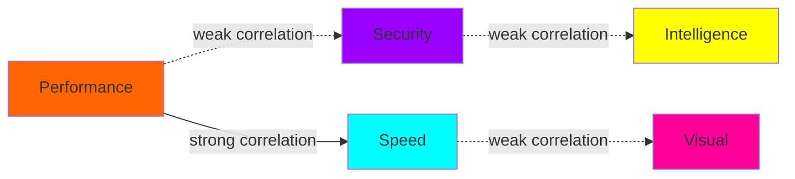

# 🕸️ Semantic Network Reasoning for Trust Debt Categories

## How AI Understands and Optimizes Category Relationships

### Abstract

This document explains how our AI system **reasons about Trust Debt categories** as nodes in a semantic network, using **natural language understanding** combined with **formal statistical methods** to optimize category design for **maximum independence** and **comprehensive coverage**.

---

## 🧠 **The AI's Mental Model**

### Trust Debt as a Semantic Graph

The AI conceptualizes Trust Debt categories as a **knowledge graph** where:

```
Nodes = Categories (measurable concepts)
Edges = Relationships (semantic or statistical)
Constraints = Independence requirements
Objective = Optimal network topology
```

**Example Network Structure:**


### Reasoning Process

#### **Step 1: Semantic Parsing**
When user says: *"Add a category for code complexity"*

```
NLP Processing:
├── Intent: ADD_CATEGORY
├── Concept: "code complexity"  
├── Semantic Fields: ["complexity", "code", "maintainability"]
├── Domain Context: software_quality
└── Constraints: must_be_independent_from_existing
```

#### **Step 2: Semantic Similarity Assessment** 
```python
def assess_semantic_overlap(new_concept, existing_categories):
    similarities = []
    for category in existing_categories:
        # Vector embedding similarity
        similarity = cosine_similarity(
            embed(new_concept),
            embed(category.description)
        )
        similarities.append((category, similarity))
    
    return similarities
```

#### **Step 3: Independence Prediction**
```python
def predict_statistical_independence(new_category, existing_categories):
    for category in existing_categories:
        predicted_correlation = semantic_similarity_to_correlation(
            calculate_semantic_overlap(new_category, category)
        )
        
        if predicted_correlation > 0.3:
            return IndependenceWarning(new_category, category, predicted_correlation)
    
    return IndependenceOK()
```

#### **Step 4: Network Integration**
```python
def integrate_into_network(new_category, network):
    # Find optimal position in network
    optimal_position = minimize(
        lambda pos: network_energy_function(network.add(new_category, pos))
    )
    
    # Validate network constraints
    if network.validate_constraints():
        return network.add(new_category, optimal_position)
    else:
        return suggest_network_modifications()
```

---

## 🤖 **Natural Language Understanding**

### Intent Classification

The AI recognizes these **user intents** and maps them to **semantic operations**:

| User Statement | Intent Class | Semantic Operation |
|----------------|--------------|-------------------|
| *"Add testing quality"* | ADD_CATEGORY | `network.add_node(concept="testing_quality")` |
| *"Remove security overlap"* | REMOVE_REDUNDANCY | `network.prune_correlated_nodes(threshold=0.3)` |
| *"Optimize for mobile"* | DOMAIN_ADAPTATION | `network.adapt_to_domain("mobile_development")` |
| *"Check independence"* | VALIDATE_STRUCTURE | `network.validate_independence()` |

### Semantic Concept Resolution

#### **Concept Embeddings**
```python
class ConceptEmbedding:
    def __init__(self, concept_text):
        self.text = concept_text
        self.vector = self.embed_concept(concept_text)
        self.semantic_fields = self.extract_fields(concept_text)
        
    def semantic_distance(self, other):
        return 1 - cosine_similarity(self.vector, other.vector)
```

#### **Domain Context Integration**
```python
def resolve_concept_in_context(concept, domain_context):
    # "performance" in "mobile development" → battery efficiency, startup time
    # "performance" in "web development" → page load, response time
    # "performance" in "data processing" → throughput, latency
    
    context_weights = get_domain_weights(domain_context)
    contextual_embedding = weighted_sum(concept.base_embedding, context_weights)
    
    return ContextualConcept(concept, domain_context, contextual_embedding)
```

---

## 🧩 **Semantic Relationship Types**

### 1. **Hierarchical Relationships**
```
Parent → Child relationship with inheritance constraints

A🚀 Performance
├── A.1 Computational Efficiency  
├── A.2 Resource Utilization
└── A.3 Algorithmic Complexity

Constraint: Children must be independent of each other
```

### 2. **Similarity Relationships**  
```
Semantic similarity without statistical correlation

B🔒 Security ≈ C🛡️ Protection (similar meaning)
But: Correlation(B🔒, C🛡️) should ≈ 0 (different measurements)
```

### 3. **Causal Relationships**
```
Temporal cause-effect patterns

D🧠 Intelligence → E🎨 Visual (better AI leads to better UX)
Statistical test: Granger causality analysis
```

### 4. **Orthogonal Relationships**
```
Conceptually and statistically independent

A🚀 Performance ⊥ B🔒 Security (different aspects, no correlation)
Target state for all category pairs
```

---

## 🔍 **AI Reasoning Patterns**

### Pattern 1: **Semantic Decomposition**

When user requests broad category:
```
User: "Add a category for quality"

AI Reasoning:
1. "Quality" is too broad and ambiguous
2. Decompose into measurable sub-concepts:
   - Code Readability
   - Test Coverage  
   - Documentation Quality
   - Interface Consistency
3. Check independence of each sub-concept
4. Recommend specific, measurable category
```

### Pattern 2: **Overlap Detection and Resolution**

When categories show correlation:
```
Detected: Performance ↔ Speed correlation = 0.89

AI Reasoning:
1. Identify semantic overlap: both measure "how fast things run"
2. Factor out common concept: "execution efficiency"  
3. Create orthogonal refinement:
   - Performance → "Computational Resource Efficiency"
   - Speed → "User-Perceived Response Latency"
4. Validate new definitions are independent
```

### Pattern 3: **Domain Adaptation**

When adapting to new context:
```
User: "Make categories specific to mobile development"

AI Reasoning:
1. Analyze mobile-specific concerns:
   - Battery life impact
   - App store compliance
   - Touch interface usability
   - Platform fragmentation
2. Map existing categories to mobile context:
   - Performance → Battery Efficiency
   - Security → Data Privacy Compliance  
   - Visual → Touch Interface Design
3. Validate independence in new context
```

---

## 🔬 **Statistical-Semantic Bridge**

### How AI Connects Meaning to Mathematics

#### **Semantic → Statistical Translation**
```python
def semantic_to_statistical(semantic_relationship):
    if semantic_relationship.type == "similar_meaning":
        predicted_correlation = 0.7  # High correlation expected
        
    elif semantic_relationship.type == "subset_relationship":
        predicted_correlation = 0.9  # Very high correlation
        
    elif semantic_relationship.type == "orthogonal_concepts":
        predicted_correlation = 0.1  # Low correlation expected
        
    return StatisticalPrediction(predicted_correlation, confidence=0.8)
```

#### **Statistical → Semantic Interpretation**
```python
def interpret_correlation(correlation_value, category_pair):
    if correlation_value > 0.7:
        return f"{category_pair[0]} and {category_pair[1]} likely measure overlapping concepts"
        
    elif correlation_value > 0.3:
        return f"Moderate relationship - consider refining definitions"
        
    else:
        return f"Good independence - categories measure distinct aspects"
```

---

## 🎯 **Optimization Strategies**

### Multi-Objective Optimization

The AI balances multiple objectives simultaneously:

```python
def optimize_category_network(network):
    objectives = {
        'independence': maximize_statistical_independence(network),
        'coverage': maximize_domain_coverage(network), 
        'clarity': maximize_semantic_clarity(network),
        'actionability': maximize_practical_utility(network)
    }
    
    # Weighted optimization
    weights = {'independence': 0.4, 'coverage': 0.3, 'clarity': 0.2, 'actionability': 0.1}
    
    return multi_objective_optimize(objectives, weights)
```

### Constraint Satisfaction

#### **Hard Constraints** (Must satisfy)
- `∀(A,B): |Correlation(A,B)| < 0.3`
- `Domain_Coverage > 0.8`
- `∀Category: Measurable(Category) = True`

#### **Soft Constraints** (Optimize towards)
- `Semantic_Clarity > 0.9`
- `Expert_Agreement > 0.8`
- `Actionability_Score > 0.7`

---

## 🧭 **AI Decision Making Process**

### Example: Processing "Remove overlapping categories"

#### **Phase 1: Intent Understanding**
```
Natural Language: "Remove overlapping categories"

Parsed Intent:
├── Action: REMOVE
├── Target: categories  
├── Criteria: overlapping
├── Implicit Goal: improve independence
└── Context: current category set
```

#### **Phase 2: Semantic Analysis**
```python
overlapping_pairs = []
for (cat_a, cat_b) in category_pairs:
    semantic_sim = calculate_semantic_similarity(cat_a, cat_b)
    statistical_corr = predict_correlation(cat_a, cat_b)
    
    if semantic_sim > 0.6 or statistical_corr > 0.3:
        overlapping_pairs.append((cat_a, cat_b, semantic_sim, statistical_corr))
```

#### **Phase 3: Optimization Strategy Selection**
```python
def select_removal_strategy(overlapping_pairs):
    if len(overlapping_pairs) > 3:
        return "comprehensive_redesign"  # Too many overlaps
    elif max(pair.correlation for pair in overlapping_pairs) > 0.8:
        return "merge_categories"  # High correlation
    else:
        return "refine_definitions"  # Moderate overlap
```

#### **Phase 4: Execution and Validation**
```python
def execute_removal_plan(strategy, overlapping_pairs):
    if strategy == "merge_categories":
        new_category = merge_preserving_information(overlapping_pairs[0])
        network.replace(overlapping_pairs[0], new_category)
        
    elif strategy == "refine_definitions":
        for (cat_a, cat_b, sim, corr) in overlapping_pairs:
            refined_a, refined_b = orthogonalize_definitions(cat_a, cat_b)
            network.update(refined_a, refined_b)
    
    # Validate result
    assert validate_independence(network.categories)
    return network
```

---

## 📊 **Semantic Measurement Framework**

### Quantifying Semantic Relationships

#### **Concept Similarity Metrics**

**1. Lexical Similarity**
```python
def lexical_similarity(term1, term2):
    # Levenshtein distance for term similarity
    return 1 - levenshtein(term1, term2) / max(len(term1), len(term2))
```

**2. Semantic Embedding Distance**
```python
def semantic_similarity(concept1, concept2):
    v1 = embed_concept(concept1.description)
    v2 = embed_concept(concept2.description)
    return cosine_similarity(v1, v2)
```

**3. Domain-Specific Overlap**
```python
def domain_overlap(cat1, cat2, domain):
    domain_keywords = get_domain_keywords(domain)
    overlap_score = 0
    
    for keyword in domain_keywords:
        if keyword in cat1.keywords and keyword in cat2.keywords:
            overlap_score += domain_keywords[keyword].weight
            
    return overlap_score / len(domain_keywords)
```

### Predictive Modeling

#### **Correlation Prediction Model**
```python
class CorrelationPredictor:
    def predict(self, category_pair):
        features = [
            semantic_similarity(category_pair),
            lexical_overlap(category_pair),
            domain_specificity(category_pair),
            hierarchical_distance(category_pair)
        ]
        
        return self.trained_model.predict(features)
```

---

## 🎨 **Visual Semantic Networks**

### Network Visualization Patterns

#### **Independence Network** (Target State)
```
A🚀 ---- (0.1) ---- B🔒
 |                   |
(0.1)              (0.1)
 |                   |  
C💨 ---- (0.1) ---- D🧠
 |                   |
(0.1)              (0.1)
 |                   |
E🎨 ---- (0.1) ---- [...]

Legend: (correlation coefficient)
Target: All edges < 0.3
```

#### **Problematic Network** (Before Optimization)
```
A🚀 ==== (0.89) ==== C💨  ← HIGH CORRELATION!
 |                    |
(0.2)               (0.1)
 |                    |  
B🔒 ---- (0.1) ---- D🧠
 |                    |
(0.1)               (0.1)
 |                    |
E🎨 ---- (0.1) ---- [...]

Problem: A🚀 and C💨 are too similar
Solution: Refine semantic definitions
```

### Semantic Field Mapping

#### **Category Semantic Fields**
```yaml
A🚀_Performance:
  primary_concepts: ["efficiency", "resource_usage", "optimization"]
  secondary_concepts: ["throughput", "utilization", "waste"]
  anti_concepts: ["latency", "response_time"]  # These belong to C💨
  
C💨_Speed:
  primary_concepts: ["latency", "response_time", "user_perception"]
  secondary_concepts: ["delay", "lag", "waiting"]
  anti_concepts: ["efficiency", "optimization"]  # These belong to A🚀
```

---

## 🔄 **Dynamic Category Evolution**

### How Categories Adapt Over Time

#### **Learning from Production Data**
```python
class CategoryEvolution:
    def learn_from_data(self, historical_measurements):
        # Detect emerging correlations
        correlation_drift = self.detect_correlation_changes(historical_measurements)
        
        # Identify semantic drift
        semantic_drift = self.detect_concept_drift(historical_measurements)
        
        # Propose adaptations
        if correlation_drift.significant:
            return self.propose_orthogonalization(correlation_drift.categories)
        
        if semantic_drift.significant:
            return self.propose_refinement(semantic_drift.categories)
            
        return self.propose_optimization()
```

#### **Contextual Adaptation**
```python
def adapt_to_context(categories, new_context):
    adapted_categories = []
    
    for category in categories:
        # Translate semantic meaning to new context
        adapted_meaning = translate_semantic_context(
            category.semantic_meaning, 
            from_context=category.original_context,
            to_context=new_context
        )
        
        # Preserve independence constraints
        adapted_category = Category(
            meaning=adapted_meaning,
            independence_constraints=category.independence_constraints
        )
        
        adapted_categories.append(adapted_category)
    
    return validate_adapted_network(adapted_categories)
```

---

## 📈 **Measurement Quality Assessment**

### How AI Evaluates Category Quality

#### **Multidimensional Quality Vector**
```python
def assess_category_quality(category, network_context):
    return QualityVector(
        independence=statistical_independence_score(category, network_context),
        clarity=semantic_clarity_score(category),
        coverage=domain_coverage_contribution(category),
        stability=measurement_stability_score(category),
        actionability=practical_utility_score(category)
    )
```

#### **Network Health Metrics**
```python
def assess_network_health(semantic_network):
    return NetworkHealth(
        overall_independence=avg_pairwise_independence(network.categories),
        domain_coverage=calculate_coverage_completeness(network),
        semantic_coherence=assess_conceptual_clarity(network),
        measurement_precision=evaluate_quantification_accuracy(network),
        evolution_stability=measure_adaptation_robustness(network)
    )
```

---

## 🎙️ **Conversational AI Reasoning**

### Natural Language → Semantic Operations

#### **Command Parsing Pipeline**
```python
def process_natural_language_command(user_input, current_network):
    # 1. Intent extraction
    intent = extract_intent(user_input)
    
    # 2. Entity recognition  
    entities = extract_entities(user_input, context=current_network)
    
    # 3. Semantic grounding
    grounded_concepts = ground_in_semantic_space(entities)
    
    # 4. Operation planning
    operations = plan_network_operations(intent, grounded_concepts)
    
    # 5. Constraint checking
    validated_operations = validate_against_constraints(operations, current_network)
    
    return ExecutionPlan(validated_operations)
```

#### **Example: Complex Command Processing**
```
User: "Make categories more specific to mobile development and ensure they don't overlap"

Processing:
├── Intent 1: DOMAIN_ADAPTATION ("mobile development")
├── Intent 2: OVERLAP_MINIMIZATION ("don't overlap")  
├── Entities: ["categories", "mobile development"]
├── Constraints: [independence_requirement, domain_specificity]
└── Operations: [adapt_to_mobile_domain(), minimize_semantic_overlap()]

Execution Plan:
1. Map current categories to mobile context
2. Refine definitions for mobile specificity
3. Test statistical independence  
4. Optimize shortlex ordering
5. Validate final network health
```

---

## 🔧 **Implementation Insights**

### Why This Approach Works

#### **1. Semantic Understanding Prevents Naive Mistakes**
```
Naive Approach: "Add 'Performance' and 'Speed' categories"
Semantic Analysis: ⚠️ "These concepts overlap significantly"
Smart Recommendation: "Use 'Computational Efficiency' and 'Response Latency'"
```

#### **2. Statistical Validation Ensures Measurement Quality**
```
Semantic Analysis: "Categories seem orthogonal"  
Statistical Testing: ⚠️ "Actually correlated at r=0.67"
Resolution: Refine definitions or merge categories
```

#### **3. Natural Language Makes It Accessible**
```
Technical Requirement: "Minimize pairwise correlation coefficients"
Natural Language: "Remove categories that overlap"
AI Translation: Same semantic operation, accessible interface
```

### Key Design Decisions

#### **Why Semantic Networks Over Simple Lists**
- **Relationships matter**: Understanding why categories correlate enables better design
- **Context sensitivity**: Same category may mean different things in different domains
- **Evolution capability**: Networks can adapt and grow while preserving constraints

#### **Why Natural Language Interface**
- **Accessibility**: Non-experts can contribute to category design
- **Intent clarity**: Natural language reveals user goals better than technical commands
- **Iteration speed**: Faster feedback loop for category refinement

#### **Why Statistical Validation**
- **Objectivity**: Removes bias from category assessment
- **Reproducibility**: Consistent evaluation criteria
- **Predictive power**: Validated independence enables reliable insights

---

## 🧪 **Testing Semantic Reasoning**

### Validation Scenarios

#### **Scenario 1: Semantic Similarity Detection**
```
Test Input: 
- Category A: "Response Speed"
- Category B: "Performance Latency"

Expected AI Reasoning:
1. High lexical similarity: "speed" ↔ "latency" are related
2. High semantic similarity: both measure timing aspects
3. Predicted correlation: > 0.7
4. Recommendation: Merge or orthogonalize

Validation: Check if AI correctly identifies the overlap
```

#### **Scenario 2: Domain Context Sensitivity**
```
Test Input:
- Categories: ["Performance", "Security"]  
- Context 1: "Web Development"
- Context 2: "Mobile Development"

Expected AI Reasoning:
Web Context:
- Performance → Page load speed, server response
- Security → HTTPS, authentication

Mobile Context:  
- Performance → Battery usage, app startup
- Security → Data privacy, local storage

Validation: Check if AI adapts definitions while preserving independence
```

#### **Scenario 3: Statistical Contradiction Resolution**
```
Test Input:
- Semantic Analysis: "Categories appear orthogonal"
- Statistical Analysis: "Correlation = 0.73"

Expected AI Reasoning:
1. Detect contradiction between semantic and statistical assessment
2. Investigate root cause: measurement method vs conceptual definition
3. Propose resolution: refine definitions or measurement approach
4. Re-validate both semantic and statistical independence

Validation: Check if AI can resolve semantic-statistical conflicts
```

---

## 🎓 **Educational Framework**

### How to Think About Semantic Networks

#### **Mental Models for Users**

**1. The "Measurement Lab" Model**
```
Think of categories as different scientific instruments:
- Each instrument measures something unique
- Instruments shouldn't interfere with each other
- Missing instruments = blind spots
- Overlapping instruments = redundant data
```

**2. The "Color Spectrum" Model**  
```
Trust Debt is white light (complex phenomenon)
Categories are prisms that separate it into distinct colors
Good categories = clean color separation
Bad categories = muddy, overlapping hues
```

**3. The "GPS Coordinates" Model**
```
Categories are coordinate axes in Trust Debt space
Each axis must be perpendicular (orthogonal)
Position in space = current Trust Debt state
Movement along axes = targeted improvements
```

#### **Learning Progression**

**Level 1: Basic Understanding**
- Categories measure different things
- Independence means no overlap
- More precise categories = better insights

**Level 2: Practical Application**  
- Recognize when categories overlap
- Use natural language to refine categories
- Interpret statistical validation results

**Level 3: Expert Design**
- Design domain-specific category sets
- Balance independence vs coverage trade-offs
- Optimize category networks for specific use cases

---

## 🔮 **Future Evolution**

### Advanced Semantic Reasoning

#### **Self-Improving Networks**
```python
class SelfEvolvingSemanticNetwork:
    def evolve(self, production_feedback):
        # Learn from measurement outcomes
        self.update_semantic_embeddings(production_feedback)
        
        # Discover new relationships
        new_relationships = self.discover_latent_relationships()
        
        # Propose network improvements
        improvements = self.propose_structural_changes()
        
        # Validate against constraints
        return self.validate_and_integrate(improvements)
```

#### **Cross-Domain Knowledge Transfer**
```python
def transfer_category_knowledge(source_domain, target_domain):
    # Extract transferable patterns
    transferable_patterns = extract_domain_invariant_patterns(source_domain)
    
    # Adapt to target domain
    adapted_patterns = adapt_patterns_to_domain(transferable_patterns, target_domain)
    
    # Generate categories
    generated_categories = instantiate_categories(adapted_patterns)
    
    # Validate independence
    return validate_transferred_categories(generated_categories)
```

---

## 📝 **Summary: The Complete Process**

### What Happens When You Say "Optimize My Categories"

1. **🧠 Semantic Understanding**
   - AI parses your intent and current category context
   - Maps categories to semantic concept space
   - Identifies potential relationships and constraints

2. **🔍 Network Analysis** 
   - Evaluates current network topology
   - Detects correlation risks and coverage gaps
   - Assesses semantic clarity and actionability

3. **⚡ Optimization**
   - Applies multi-objective optimization algorithms
   - Balances independence, coverage, and clarity
   - Generates improved category network

4. **✅ Validation**
   - Tests statistical independence requirements
   - Validates semantic coherence
   - Confirms practical utility

5. **📚 Education**
   - Explains what was changed and why
   - Provides clear next steps
   - Teaches underlying principles

### The AI's "Theory of Mind" for Categories

The AI understands that **categories are not just labels** - they are:

- **Cognitive tools** that shape how we think about Trust Debt
- **Measurement instruments** that determine what we can detect  
- **Communication devices** that enable shared understanding
- **Action catalysts** that guide improvement priorities

By treating category design as **semantic network optimization**, we ensure that our Trust Debt measurement system is both **scientifically rigorous** and **intuitively meaningful**.

---

**🎯 Key Insight**: The semantic network approach allows AI to reason about categories the way domain experts do - understanding both the **mathematical constraints** (independence) and the **meaningful relationships** (semantic coherence) that make categories useful for human decision-making.