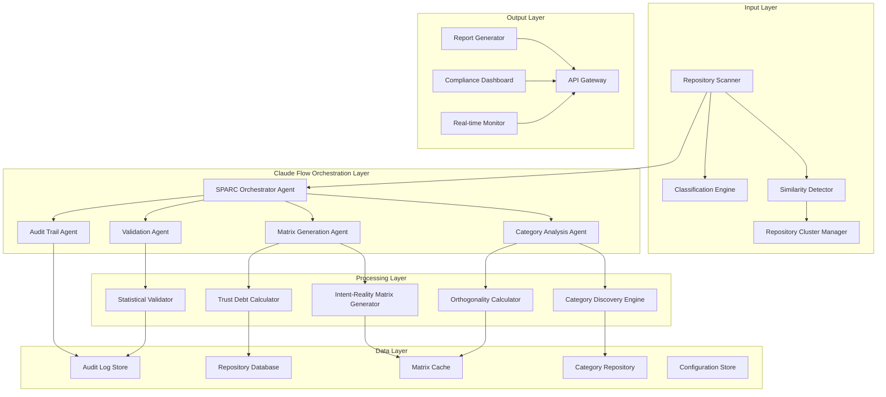
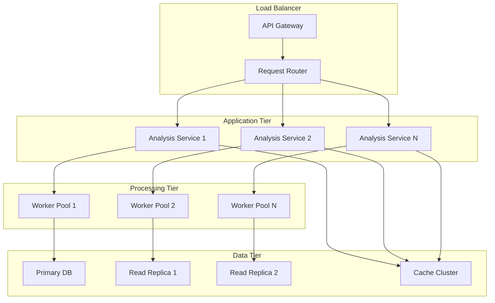

# SPARC Architecture Phase: System Design for Regulatory-Grade Trust Debt Analysis

## 1. System Overview

This document defines the comprehensive system architecture for the regulatory-grade Trust Debt analysis system, incorporating multi-agent coordination using Claude Flow, data flow management, validation capabilities, and audit trail systems.

## 2. High-Level Architecture

### 2.1 System Architecture Diagram



### 2.2 Component Relationships

**Primary Data Flow:**
1. Repository → Similarity Detection → Classification → Clustering
2. Clusters → Category Discovery → Orthogonality Validation → Matrix Generation  
3. Matrix → Trust Debt Calculation → Statistical Validation → Report Generation
4. All operations → Audit Trail → Compliance Dashboard

**Multi-Agent Coordination:**
- SPARC Orchestrator coordinates phase transitions
- Specialized agents handle domain-specific processing
- Claude Flow manages parallel execution and resource allocation
- Audit Trail Agent ensures complete traceability

## 3. Claude Flow Multi-Agent Architecture

### 3.1 Agent Topology Design

```typescript
interface AgentTopology {
  topology: "hierarchical" | "mesh" | "hybrid";
  coordinator: SPARCOrchestratorAgent;
  specialists: SpecialistAgent[];
  coordination_pattern: CoordinationPattern;
}

interface SPARCOrchestratorAgent {
  role: "coordinator";
  capabilities: [
    "phase_management",
    "quality_gate_enforcement", 
    "resource_allocation",
    "workflow_coordination"
  ];
  subordinates: SpecialistAgent[];
}

interface SpecialistAgent {
  role: "specialist";
  specialization: AgentSpecialization;
  capabilities: string[];
  coordination_mode: "hierarchical" | "peer_to_peer";
}

enum AgentSpecialization {
  REPOSITORY_ANALYSIS = "repository_analysis",
  CATEGORY_DISCOVERY = "category_discovery", 
  ORTHOGONALITY_CALCULATION = "orthogonality_calculation",
  MATRIX_GENERATION = "matrix_generation",
  TRUST_DEBT_CALCULATION = "trust_debt_calculation",
  VALIDATION_AND_AUDIT = "validation_and_audit",
  REPORT_GENERATION = "report_generation"
}
```

### 3.2 Agent Coordination Patterns

#### 3.2.1 Hierarchical Coordination (Default)
```pseudocode
AGENT_TOPOLOGY: Hierarchical
COORDINATOR: SPARCOrchestratorAgent

WORKFLOW SPARCAnalysisWorkflow:
  PHASE specification:
    SPAWN repository_analysis_agent WITH repository_data
    SPAWN similarity_detection_agent WITH repository_clusters  
    WAIT_FOR_COMPLETION both_agents
    VALIDATE specification_quality_gate
    
  PHASE pseudocode:  
    SPAWN category_discovery_agent WITH repository_clusters
    SPAWN orthogonality_agent WITH category_candidates
    COORDINATE real_time_feedback_loop
    VALIDATE algorithm_quality_gate
    
  PHASE architecture:
    SPAWN matrix_generation_agent WITH validated_categories
    SPAWN trust_debt_agent WITH matrix_specifications
    VALIDATE architecture_quality_gate
    
  PHASE refinement:
    SPAWN validation_agent WITH calculated_results
    SPAWN audit_agent WITH all_operations
    COORDINATE cross_validation_protocol
    VALIDATE refinement_quality_gate
    
  PHASE completion:
    SPAWN report_generation_agent WITH validated_results
    COORDINATE final_integration
    VALIDATE completion_quality_gate
END WORKFLOW
```

#### 3.2.2 Mesh Coordination (High-Throughput)
```pseudocode
AGENT_TOPOLOGY: Mesh
COORDINATION: Peer-to-peer with message passing

WORKFLOW HighThroughputAnalysis:
  INITIALIZE mesh_coordination_layer
  
  PARALLEL_EXECUTION:
    repository_agents[] = SPAWN_MULTIPLE repository_analysis_agent FOR each_repository
    category_agents[] = SPAWN_MULTIPLE category_discovery_agent FOR each_cluster
    matrix_agents[] = SPAWN_MULTIPLE matrix_generation_agent FOR each_category_set
    
  MESSAGE_PASSING_COORDINATION:
    repository_agents BROADCAST similarity_data TO category_agents
    category_agents BROADCAST orthogonality_data TO matrix_agents  
    matrix_agents BROADCAST trust_debt_data TO validation_agents
    
  CONSENSUS_VALIDATION:
    COLLECT all_agent_results
    PERFORM cross_agent_validation
    ACHIEVE consensus ON final_results
END WORKFLOW
```

### 3.3 Agent Memory and State Management

```typescript
interface AgentMemorySystem {
  short_term_memory: WorkingMemory;
  long_term_memory: PersistentMemory;
  shared_memory: SharedAgentMemory;
  coordination_state: CoordinationState;
}

interface WorkingMemory {
  current_task: Task;
  intermediate_results: any[];
  error_state: ErrorState;
  performance_metrics: Metrics;
}

interface PersistentMemory {
  learned_patterns: Pattern[];
  optimization_history: OptimizationRecord[];
  failure_patterns: FailurePattern[];
  success_metrics: SuccessMetrics;
}

interface SharedAgentMemory {
  global_repository_knowledge: RepositoryKnowledgeBase;
  category_learning_database: CategoryLearningDB;
  validation_rules: ValidationRuleSet;
  audit_requirements: AuditRequirements;
}
```

## 4. Data Flow Architecture

### 4.1 Data Pipeline Design

```mermaid
flowchart LR
    subgraph "Ingestion Pipeline"
        A[Repository Scanner] --> B[Metadata Extractor]
        B --> C[Content Analyzer]
        C --> D[Feature Extractor]
    end
    
    subgraph "Processing Pipeline"
        D --> E[Similarity Calculator]
        D --> F[Classification Engine]
        E --> G[Cluster Generator]
        F --> H[Category Discovery]
        G --> H
        H --> I[Orthogonality Validator]
        I --> J[Matrix Generator]
    end
    
    subgraph "Validation Pipeline"
        J --> K[Trust Debt Calculator]
        K --> L[Statistical Validator]
        L --> M[Cross-Repository Validator]
        M --> N[Audit Trail Generator]
    end
    
    subgraph "Output Pipeline"
        N --> O[Report Generator]
        O --> P[Compliance Dashboard]
        O --> Q[API Endpoints]
        N --> R[Audit Log Store]
    end
```



### 4.2 Data Storage Architecture

#### 4.2.1 Repository Database Schema
```sql
-- Repository metadata and analysis results
CREATE TABLE repositories (
    id UUID PRIMARY KEY,
    url TEXT NOT NULL,
    name TEXT NOT NULL,
    classification_level1 TEXT NOT NULL,
    classification_level2 TEXT NOT NULL,
    classification_confidence DECIMAL(3,2),
    similarity_vector VECTOR(512),
    created_at TIMESTAMP WITH TIME ZONE DEFAULT NOW(),
    updated_at TIMESTAMP WITH TIME ZONE DEFAULT NOW(),
    analysis_version TEXT NOT NULL
);

-- Repository similarity relationships  
CREATE TABLE repository_similarities (
    repo1_id UUID REFERENCES repositories(id),
    repo2_id UUID REFERENCES repositories(id),
    similarity_score DECIMAL(4,3) NOT NULL,
    similarity_components JSONB NOT NULL,
    calculated_at TIMESTAMP WITH TIME ZONE DEFAULT NOW(),
    PRIMARY KEY (repo1_id, repo2_id)
);

-- Repository clusters for validation
CREATE TABLE repository_clusters (
    id UUID PRIMARY KEY,
    cluster_algorithm TEXT NOT NULL,
    cluster_parameters JSONB NOT NULL,
    repositories UUID[] NOT NULL,
    cluster_statistics JSONB NOT NULL,
    created_at TIMESTAMP WITH TIME ZONE DEFAULT NOW()
);
```

#### 4.2.2 Category Management Schema
```sql
-- Category definitions with versioning
CREATE TABLE categories (
    id UUID PRIMARY KEY,
    name TEXT NOT NULL,
    version INTEGER NOT NULL DEFAULT 1,
    keywords TEXT[] NOT NULL,
    weights DECIMAL[] NOT NULL,
    domain TEXT NOT NULL,
    parent_category_id UUID REFERENCES categories(id),
    orthogonality_requirements JSONB NOT NULL,
    created_at TIMESTAMP WITH TIME ZONE DEFAULT NOW(),
    created_by TEXT NOT NULL,
    UNIQUE(name, version)
);

-- Category orthogonality matrix cache
CREATE TABLE category_orthogonality (
    category_set_hash TEXT PRIMARY KEY,
    category_ids UUID[] NOT NULL,
    orthogonality_matrix DECIMAL[][] NOT NULL,
    validation_results JSONB NOT NULL,
    calculated_at TIMESTAMP WITH TIME ZONE DEFAULT NOW(),
    expires_at TIMESTAMP WITH TIME ZONE NOT NULL
);

-- Category performance tracking
CREATE TABLE category_performance (
    category_id UUID REFERENCES categories(id),
    repository_id UUID REFERENCES repositories(id),
    accuracy_score DECIMAL(4,3) NOT NULL,
    precision_score DECIMAL(4,3) NOT NULL,
    recall_score DECIMAL(4,3) NOT NULL,
    validated_by TEXT NOT NULL,
    validated_at TIMESTAMP WITH TIME ZONE DEFAULT NOW(),
    PRIMARY KEY (category_id, repository_id)
);
```

#### 4.2.3 Analysis Results Schema
```sql
-- Trust debt analysis results
CREATE TABLE trust_debt_analyses (
    id UUID PRIMARY KEY,
    repository_id UUID REFERENCES repositories(id),
    category_set_version TEXT NOT NULL,
    intent_reality_matrix DECIMAL[][] NOT NULL,
    trust_debt_score DECIMAL(6,2) NOT NULL,
    status TEXT CHECK (status IN ('GOOD', 'WARNING', 'CRITICAL', 'CRISIS')),
    category_breakdown JSONB NOT NULL,
    matrix_metadata JSONB NOT NULL,
    calculation_config_hash TEXT NOT NULL,
    analyzed_at TIMESTAMP WITH TIME ZONE DEFAULT NOW(),
    analysis_duration_ms INTEGER NOT NULL
);

-- Cross-repository validation results
CREATE TABLE validation_results (
    id UUID PRIMARY KEY,
    cluster_id UUID REFERENCES repository_clusters(id),
    validation_type TEXT NOT NULL,
    statistical_tests JSONB NOT NULL,
    confidence_intervals JSONB NOT NULL,
    p_values JSONB NOT NULL,
    effect_sizes JSONB NOT NULL,
    validation_passed BOOLEAN NOT NULL,
    validated_at TIMESTAMP WITH TIME ZONE DEFAULT NOW(),
    validation_config JSONB NOT NULL
);
```

### 4.3 Caching Strategy

#### 4.3.1 Multi-Level Cache Architecture
```typescript
interface CacheArchitecture {
  l1_cache: InMemoryCache;        // Hot data, <1ms access
  l2_cache: RedisCacheCluster;    // Warm data, <10ms access
  l3_cache: DatabaseCache;        // Cold data, <100ms access
  cache_coherence: CoherenceProtocol;
}

interface CacheConfiguration {
  repository_similarity: {
    ttl: "24h";
    max_entries: 100000;
    eviction_policy: "LRU";
  };
  category_orthogonality: {
    ttl: "1h";  // Short TTL for real-time feedback
    max_entries: 10000;
    eviction_policy: "LFU";
  };
  trust_debt_matrices: {
    ttl: "12h";
    max_entries: 50000;
    eviction_policy: "LRU";
    compression: "gzip";
  };
}
```

#### 4.3.2 Cache Invalidation Strategy
```pseudocode
CACHE_INVALIDATION_STRATEGY:
  ON repository_update:
    INVALIDATE repository_similarity_cache[repository_id]
    INVALIDATE trust_debt_cache[repository_id]
    MARK cluster_cache AS potentially_stale
    
  ON category_modification:
    INVALIDATE category_orthogonality_cache[category_set_hash]
    INVALIDATE trust_debt_cache WHERE category_set CONTAINS modified_category
    TRIGGER background_recalculation FOR affected_repositories
    
  ON algorithm_update:
    FLUSH all_algorithm_dependent_caches
    INCREMENT cache_version
    TRIGGER full_system_recalculation
```

## 5. Validation and Audit Trail System

### 5.1 Audit Trail Architecture

#### 5.1.1 Comprehensive Audit Logging
```typescript
interface AuditEvent {
  event_id: string;
  timestamp: string;           // ISO 8601 with nanosecond precision
  user_id?: string;           // Optional for system events
  session_id: string;
  event_type: AuditEventType;
  resource_type: string;
  resource_id: string;
  action: string;
  before_state?: any;
  after_state?: any;
  reasoning_chain?: string[];  // AI decision reasoning
  system_context: SystemContext;
  cryptographic_signature: string;
}

enum AuditEventType {
  USER_ACTION = "user_action",
  SYSTEM_DECISION = "system_decision",
  DATA_TRANSFORMATION = "data_transformation",
  CONFIGURATION_CHANGE = "configuration_change",
  ACCESS_EVENT = "access_event",
  ERROR_EVENT = "error_event",
  VALIDATION_EVENT = "validation_event"
}

interface SystemContext {
  node_id: string;
  process_id: string;
  thread_id: string;
  memory_usage: number;
  cpu_usage: number;
  active_agents: string[];
  coordinator_state: string;
}
```

#### 5.1.2 Audit Log Storage and Retrieval
```sql
-- Immutable audit log with cryptographic integrity
CREATE TABLE audit_log (
    event_id UUID PRIMARY KEY,
    timestamp TIMESTAMP(9) WITH TIME ZONE NOT NULL,
    user_id TEXT,
    session_id TEXT NOT NULL,
    event_type TEXT NOT NULL,
    resource_type TEXT NOT NULL,  
    resource_id TEXT NOT NULL,
    action TEXT NOT NULL,
    before_state JSONB,
    after_state JSONB,
    reasoning_chain TEXT[],
    system_context JSONB NOT NULL,
    cryptographic_signature TEXT NOT NULL,
    previous_hash TEXT,
    block_hash TEXT NOT NULL
);

-- Audit log integrity verification
CREATE TABLE audit_integrity (
    block_number BIGINT PRIMARY KEY,
    block_hash TEXT NOT NULL,
    previous_block_hash TEXT,
    event_count INTEGER NOT NULL,
    merkle_root TEXT NOT NULL,
    created_at TIMESTAMP WITH TIME ZONE NOT NULL
);

-- Fast access indexes
CREATE INDEX idx_audit_timestamp ON audit_log (timestamp);
CREATE INDEX idx_audit_user_id ON audit_log (user_id);  
CREATE INDEX idx_audit_resource ON audit_log (resource_type, resource_id);
CREATE INDEX idx_audit_session ON audit_log (session_id);
```

### 5.2 Validation Architecture

#### 5.2.1 Multi-Stage Validation Pipeline
```typescript
interface ValidationPipeline {
  stages: ValidationStage[];
  parallel_execution: boolean;
  failure_handling: FailureHandling;
  audit_integration: AuditIntegration;
}

interface ValidationStage {
  stage_name: string;
  validators: Validator[];
  dependencies: string[];
  timeout_ms: number;
  retry_policy: RetryPolicy;
}

abstract class Validator {
  abstract validate(input: any): ValidationResult;
  abstract get_validation_schema(): Schema;
  abstract get_confidence_level(): number;
}

class RepositorySimilarityValidator extends Validator {
  validate(similarity_data: SimilarityData): ValidationResult {
    // Validate similarity calculations against known benchmarks
    // Check for mathematical consistency
    // Verify reproducibility across runs
  }
}

class CategoryOrthogonalityValidator extends Validator {
  validate(orthogonality_matrix: Matrix): ValidationResult {
    // Verify matrix properties (symmetric, positive definite)
    // Check threshold compliance
    // Validate mathematical constraints
  }
}
```

#### 5.2.2 Statistical Validation Framework
```typescript
interface StatisticalValidation {
  bootstrap_validation: BootstrapValidation;
  cross_validation: CrossValidation;
  hypothesis_testing: HypothesisTestSuite;
  confidence_intervals: ConfidenceIntervalCalculation;
}

interface BootstrapValidation {
  sample_size: number;
  bootstrap_iterations: number;
  confidence_level: number;
  bias_correction: boolean;
}

interface HypothesisTestSuite {
  normality_tests: NormalityTest[];
  homogeneity_tests: HomogeneityTest[];
  independence_tests: IndependenceTest[];
  effect_size_calculations: EffectSizeTest[];
}

class StatisticalValidator {
  async performBootstrapValidation(data: number[]): Promise<BootstrapResult> {
    // Implement bootstrap sampling for confidence intervals
    // Calculate bias-corrected confidence intervals  
    // Validate statistical assumptions
  }
  
  async performCrossRepositoryValidation(clusters: RepositoryCluster[]): Promise<ValidationResult> {
    // Implement Kruskal-Wallis test for between-cluster differences
    // Post-hoc testing with multiple comparison correction
    // Effect size calculation (eta-squared, Cohen's d)
  }
}
```

## 6. Configuration Management System

### 6.1 Configuration Architecture

#### 6.1.1 Hierarchical Configuration
```typescript
interface ConfigurationSystem {
  global_config: GlobalConfiguration;
  environment_config: EnvironmentConfiguration;
  user_config: UserConfiguration;
  runtime_config: RuntimeConfiguration;
  configuration_validation: ConfigurationValidator;
}

interface GlobalConfiguration {
  algorithm_parameters: AlgorithmParameters;
  validation_thresholds: ValidationThresholds;
  performance_limits: PerformanceLimits;
  security_settings: SecuritySettings;
  compliance_requirements: ComplianceRequirements;
}

interface AlgorithmParameters {
  similarity_weights: SimilarityWeights;
  orthogonality_threshold: number;
  trust_debt_scaling_factor: number;
  time_decay_rate: number;
  maximum_age_penalty: number;
  matrix_normalization_method: string;
  statistical_confidence_level: number;
}

interface ValidationThresholds {
  good_threshold: number;
  warning_threshold: number;
  critical_threshold: number;
  similarity_minimum: number;
  orthogonality_minimum: number;
  confidence_minimum: number;
}
```

#### 6.1.2 Configuration Versioning and Rollback
```sql
-- Configuration version management
CREATE TABLE configuration_versions (
    version_id UUID PRIMARY KEY,
    version_number INTEGER NOT NULL,
    configuration_data JSONB NOT NULL,
    schema_version TEXT NOT NULL,
    created_by TEXT NOT NULL,
    created_at TIMESTAMP WITH TIME ZONE DEFAULT NOW(),
    approved_by TEXT,
    approved_at TIMESTAMP WITH TIME ZONE,
    rollback_version UUID REFERENCES configuration_versions(version_id),
    validation_results JSONB NOT NULL
);

-- Active configuration tracking
CREATE TABLE active_configurations (
    environment TEXT PRIMARY KEY,
    active_version_id UUID REFERENCES configuration_versions(version_id),
    activated_at TIMESTAMP WITH TIME ZONE DEFAULT NOW(),
    activated_by TEXT NOT NULL
);

-- Configuration change approvals
CREATE TABLE configuration_approvals (
    approval_id UUID PRIMARY KEY,
    version_id UUID REFERENCES configuration_versions(version_id),
    approver_role TEXT NOT NULL,
    approver_id TEXT NOT NULL,
    approval_status TEXT CHECK (approval_status IN ('pending', 'approved', 'rejected')),
    approval_comments TEXT,
    approved_at TIMESTAMP WITH TIME ZONE
);
```

### 6.2 Configuration Validation

#### 6.2.1 Schema Validation
```typescript
class ConfigurationValidator {
  validateConfiguration(config: Configuration): ValidationResult {
    // JSON Schema validation
    const schema_validation = this.validateAgainstSchema(config);
    
    // Business rule validation
    const business_validation = this.validateBusinessRules(config);
    
    // Mathematical constraint validation
    const math_validation = this.validateMathematicalConstraints(config);
    
    // Security validation
    const security_validation = this.validateSecurityRequirements(config);
    
    return this.combineValidationResults([
      schema_validation,
      business_validation, 
      math_validation,
      security_validation
    ]);
  }
  
  validateMathematicalConstraints(config: Configuration): ValidationResult {
    const errors = [];
    
    // Validate weights sum to 1.0
    const weight_sum = Object.values(config.similarity_weights).reduce((a, b) => a + b, 0);
    if (Math.abs(weight_sum - 1.0) > 1e-10) {
      errors.push("Similarity weights must sum to 1.0");
    }
    
    // Validate threshold ordering
    if (config.validation_thresholds.good >= config.validation_thresholds.warning) {
      errors.push("Good threshold must be less than warning threshold");
    }
    
    return { valid: errors.length === 0, errors };
  }
}
```

## 7. Performance and Scalability Architecture

### 7.1 Performance Optimization Strategy

#### 7.1.1 Computational Optimization
```typescript
interface PerformanceOptimization {
  parallel_processing: ParallelProcessingConfig;
  memory_management: MemoryOptimization;
  algorithm_optimization: AlgorithmOptimization;
  caching_strategy: CachingStrategy;
}

interface ParallelProcessingConfig {
  max_concurrent_repositories: number;
  worker_thread_pool_size: number;
  matrix_calculation_parallelization: boolean;
  gpu_acceleration: boolean;
  distributed_processing: boolean;
}

class PerformanceOptimizedCalculator {
  async calculateSimilarityMatrix(repositories: Repository[]): Promise<Matrix> {
    // Use Web Workers for CPU-intensive calculations
    const worker_pool = new WorkerPool(this.config.worker_thread_pool_size);
    
    // Partition repositories for parallel processing
    const partitions = this.partitionRepositories(repositories);
    
    // Calculate similarity in parallel
    const similarity_promises = partitions.map(partition => 
      worker_pool.execute('calculate_similarity', partition)
    );
    
    const partial_matrices = await Promise.all(similarity_promises);
    
    // Combine results
    return this.combineMatrices(partial_matrices);
  }
}
```

#### 7.1.2 Scalability Architecture


### 7.2 Monitoring and Observability

#### 7.2.1 System Metrics
```typescript
interface SystemMetrics {
  performance_metrics: PerformanceMetrics;
  agent_coordination_metrics: CoordinationMetrics;
  business_metrics: BusinessMetrics;
  security_metrics: SecurityMetrics;
}

interface PerformanceMetrics {
  response_times: TimingMetrics;
  throughput: ThroughputMetrics;
  resource_utilization: ResourceMetrics;
  error_rates: ErrorRateMetrics;
}

interface CoordinationMetrics {
  agent_spawning_time: number;
  coordination_overhead: number;
  message_passing_latency: number;
  consensus_achievement_time: number;
  workflow_completion_rate: number;
}

class MetricsCollector {
  collectAgentMetrics(agent: Agent): AgentMetrics {
    return {
      agent_id: agent.id,
      agent_type: agent.type,
      tasks_completed: agent.getCompletedTaskCount(),
      average_task_duration: agent.getAverageTaskDuration(),
      success_rate: agent.getSuccessRate(),
      memory_usage: agent.getMemoryUsage(),
      cpu_usage: agent.getCpuUsage(),
      coordination_efficiency: agent.getCoordinationEfficiency()
    };
  }
}
```

## 8. Security Architecture

### 8.1 Security Framework

#### 8.1.1 Defense in Depth
```typescript
interface SecurityArchitecture {
  authentication: AuthenticationSystem;
  authorization: AuthorizationSystem;
  encryption: EncryptionSystem;
  audit_security: AuditSecurity;
  threat_detection: ThreatDetectionSystem;
}

interface AuthenticationSystem {
  multi_factor_authentication: MFAConfiguration;
  session_management: SessionManager;
  certificate_management: CertificateManager;
  identity_provider_integration: IdentityProviderConfig;
}

interface AuthorizationSystem {
  role_based_access_control: RBACConfiguration;
  attribute_based_access_control: ABACConfiguration;
  resource_access_policies: AccessPolicy[];
  privilege_escalation_protection: PrivilegeProtection;
}
```

#### 8.1.2 Secure Communication
```typescript
class SecureCommunicationManager {
  establishSecureChannel(agent1: Agent, agent2: Agent): SecureChannel {
    // Implement TLS 1.3 for agent communication
    // Use mutual authentication with certificates
    // Implement perfect forward secrecy
    
    const tls_config = {
      protocol: 'TLSv1.3',
      cipher_suites: ['TLS_AES_256_GCM_SHA384', 'TLS_CHACHA20_POLY1305_SHA256'],
      mutual_authentication: true,
      perfect_forward_secrecy: true
    };
    
    return new SecureChannel(agent1, agent2, tls_config);
  }
  
  signAuditEvent(event: AuditEvent): string {
    // Digital signature for audit event integrity
    const signing_key = this.loadSigningKey();
    return this.cryptographicSign(event, signing_key);
  }
}
```

## 9. Quality Gates and Deliverables

### 9.1 Architecture Quality Gates

#### Quality Gate 1: Component Architecture Review
- [ ] All components defined with clear interfaces
- [ ] Data flow diagrams validated by stakeholders
- [ ] Claude Flow integration patterns verified
- [ ] Performance requirements mapped to architecture

#### Quality Gate 2: Security Architecture Review  
- [ ] Security architecture reviewed by security team
- [ ] Threat model completed and approved
- [ ] Audit trail design meets regulatory requirements
- [ ] Encryption requirements properly implemented

#### Quality Gate 3: Scalability Validation
- [ ] Performance benchmarks defined
- [ ] Scalability testing approach approved
- [ ] Resource requirements estimated and budgeted
- [ ] Monitoring and observability plan approved

### 9.2 Architecture Deliverables

1. **System Architecture Document** (This document)
2. **Component Interface Specifications**
3. **Data Flow Diagrams and Schemas** 
4. **Claude Flow Agent Configuration**
5. **Security Architecture Specification**
6. **Performance and Scalability Plan**
7. **Configuration Management Design**
8. **Monitoring and Observability Framework**

---

**Document Control:**
- Version: 1.0  
- Created: 2025-09-03
- Status: DRAFT
- Dependencies: 
  - Specification Phase (01-REGULATORY_REQUIREMENTS.md)
  - Pseudocode Phase (02-ALGORITHMIC_DESIGN.md)
- Next Phase: Refinement Phase