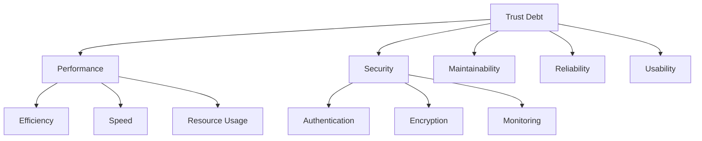
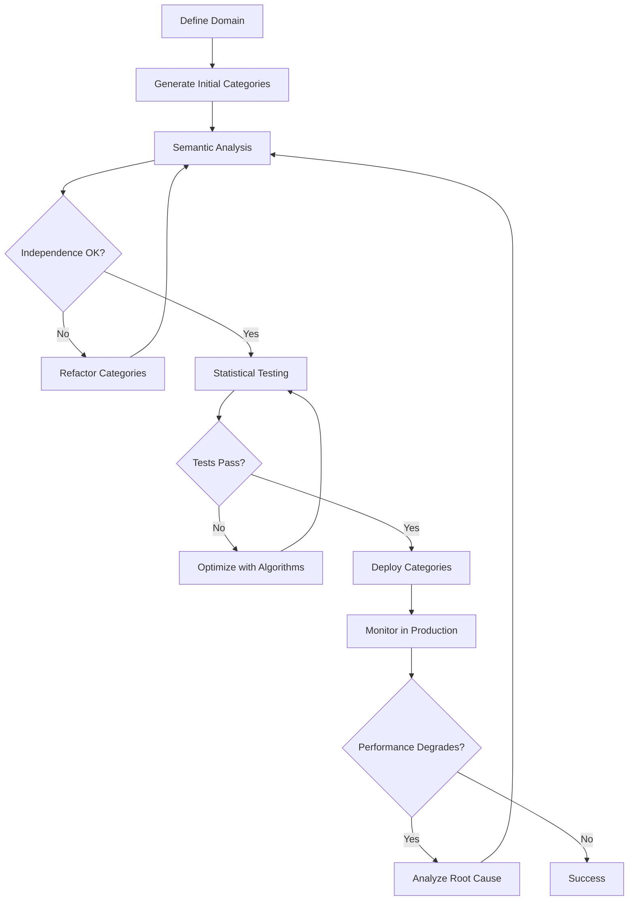

# 🧠 Trust Debt Category Design Methodology

## The Semantic Network Approach to Trust Debt Measurement

### Abstract

Trust Debt categories form a **semantic network** where each node represents a measurable aspect of software quality, and edges represent potential correlations or dependencies. This document explains our methodology for designing statistically independent categories that form an optimal semantic measurement space for Trust Debt analysis.

---

## 📊 **Core Principles**

### 1. **Statistical Independence** 
Categories must be **orthogonal** in the statistical sense - changes in one category should not predict changes in another.

**Mathematical Definition:**
```
P(A ∩ B) = P(A) × P(B)
```
Where A and B are category measurements across commits.

**Why This Matters:**
- Prevents double-counting of issues
- Enables clear cause-effect analysis
- Provides actionable insights without false correlations

### 2. **Semantic Orthogonality**
Categories should measure **conceptually distinct** aspects of software quality.

**Example of Good Orthogonality:**
- **Performance** (computational efficiency) 
- **Security** (protection against threats)
- **Maintainability** (code readability and structure)

**Example of Poor Orthogonality:**
- **Speed** (response time)
- **Performance** (execution speed) ← **These overlap semantically**

### 3. **Domain Completeness**
Categories together should comprehensively cover the Trust Debt measurement space.

**Coverage Assessment:**
```
Domain Coverage = |Aspects Covered| / |Total Domain Aspects|
```

---

## 🔬 **The Category Design Process**

### Phase 1: **Semantic Network Analysis**

#### 1.1 **Domain Decomposition**
Break down the Trust Debt domain into fundamental aspects:



#### 1.2 **Correlation Risk Assessment**
Identify potential semantic overlaps:

| Category Pair | Correlation Risk | Reason |
|---------------|------------------|--------|
| Performance ↔ Speed | **HIGH** | Speed is subset of Performance |
| Security ↔ Authentication | **MEDIUM** | Authentication is subset of Security |
| Maintainability ↔ Readability | **HIGH** | Readability is subset of Maintainability |

#### 1.3 **Orthogonal Decomposition**
Find the **minimal spanning set** of orthogonal categories:

```
Orthogonal Set = {A, B, C, D, E}
where: Correlation(Ai, Aj) ≈ 0 for i ≠ j
```

### Phase 2: **Statistical Validation**

#### 2.1 **Independence Testing**
For each category pair (Ci, Cj):

**Chi-Square Test:**
```
H₀: Categories are independent
H₁: Categories are dependent
α = 0.05 (significance level)
```

**Mutual Information:**
```
MI(A,B) = Σ p(a,b) × log(p(a,b) / (p(a) × p(b)))
```
Where MI ≈ 0 indicates independence.

**Correlation Matrix:**
```
ρ(A,B) = Cov(A,B) / (σ_A × σ_B)
```
Target: |ρ| < 0.3 for all category pairs.

#### 2.2 **Granger Causality Analysis**
Test temporal relationships:

```
Does A(t-k) predict B(t)?
F-test: SSE_restricted vs SSE_unrestricted
```

### Phase 3: **Shortlex Optimization**

#### 3.1 **Objective Function**
Minimize semantic overlap while maximizing coverage:

```
Objective = α × Coverage(C) - β × Overlap(C) + γ × Orthogonality(C)
```

Where:
- **Coverage(C)**: Domain completeness score
- **Overlap(C)**: Average semantic similarity between categories  
- **Orthogonality(C)**: Statistical independence measure
- **α, β, γ**: Weighting parameters

#### 3.2 **Optimization Algorithms**

**Greedy Approach:**
1. Start with category maximizing initial objective
2. Add categories that minimize marginal overlap
3. Continue until domain coverage target reached

**Simulated Annealing:**
```
Accept worse solution with probability: e^(-ΔE/T)
Where ΔE = change in objective function
      T = temperature (decreases over time)
```

**Genetic Algorithm:**
- **Population**: Different category orderings
- **Fitness**: Objective function value
- **Crossover**: Order-preserving recombination
- **Mutation**: Random category swaps

---

## 🧩 **The Semantic Network Model**

### Trust Debt as a Multidimensional Space

Trust Debt exists in a **multidimensional semantic space** where each dimension represents an orthogonal aspect of software quality:

```
Trust Debt Vector = [Performance, Security, Maintainability, Reliability, Usability]
```

### Network Properties

#### **Nodes (Categories)**
- **Weight**: Importance in overall Trust Debt measurement
- **Attributes**: Keywords, measurement methods, validation criteria
- **Constraints**: Independence requirements, domain coverage needs

#### **Edges (Relationships)**
- **Correlation Strength**: Statistical dependency measure
- **Semantic Similarity**: Conceptual overlap assessment  
- **Causal Direction**: Temporal influence patterns
- **Constraint Type**: Independence requirement, hierarchical relationship

### Mathematical Representation

```python
class TrustDebtSemanticNetwork:
    def __init__(self):
        self.nodes = {}  # Category ID -> CategoryNode
        self.edges = {}  # (ID1, ID2) -> RelationshipEdge
        self.constraints = []  # Independence constraints
    
    def add_category(self, category, parent=None):
        """Add category to semantic network"""
        self.validate_orthogonality(category, self.nodes.values())
        self.nodes[category.id] = CategoryNode(category)
        
    def validate_independence(self, data):
        """Validate statistical independence constraints"""
        for constraint in self.constraints:
            if not constraint.validate(data):
                raise IndependenceViolation(constraint)
```

---

## 🎯 **Category Design Patterns**

### Pattern 1: **Hierarchical Decomposition**

**Problem**: Domain too broad for single category
**Solution**: Create parent-child relationships with independence constraints

```
A🚀 Performance
├── A🚀.1⚡ Optimization  ← Should be independent
├── A🚀.2🔥 Caching       ← Should be independent  
└── A🚀.3📈 Scaling      ← Should be independent
```

**Validation**: Child categories must be mutually independent.

### Pattern 2: **Orthogonal Factorization**

**Problem**: Categories showing high correlation
**Solution**: Factor out common elements into separate category

```
Original (Correlated):
- Performance (includes speed)
- Speed (subset of performance)

Factored (Orthogonal):  
- Computational Efficiency (algorithmic performance)
- Response Latency (user-perceived speed)
```

### Pattern 3: **Domain-Specific Adaptation**

**Problem**: General categories don't fit specific domain
**Solution**: Adapt semantic meaning while preserving orthogonality

```
General Software → Mobile Development:
- Performance → Battery Efficiency
- Security → Data Privacy
- Usability → Touch Interface
```

---

## 🔍 **How We Think About Categories**

### The Mental Model

Think of Trust Debt categories as **measurement instruments** in a scientific laboratory:

1. **Each instrument** (category) must measure something different
2. **Instruments shouldn't interfere** with each other (independence)
3. **Together they cover** the full phenomenon (completeness)
4. **Results are reproducible** and meaningful (validity)

### Semantic Network Construction

#### Step 1: **Concept Mapping**
```
"What are all the ways software can accumulate Trust Debt?"

→ Performance issues (slow code)
→ Security vulnerabilities (unsafe code)  
→ Maintainability problems (messy code)
→ Reliability failures (unstable code)
→ Usability defects (confusing interfaces)
```

#### Step 2: **Orthogonalization**
```
"Can these concepts be measured independently?"

Performance ⊥ Security? → YES (computational speed vs protection)
Performance ⊥ Maintainability? → YES (efficiency vs readability)  
Security ⊥ Maintainability? → YES (protection vs code structure)
```

#### Step 3: **Validation Testing**
```
"Do real measurements confirm independence?"

Correlation Matrix:
           Perf  Sec   Maint  Rel   Usab
Perf       1.0   0.1   0.2    0.3   0.1
Sec        0.1   1.0   0.1    0.2   0.0  
Maint      0.2   0.1   1.0    0.4   0.2
Rel        0.3   0.2   0.4    1.0   0.1
Usab       0.1   0.0   0.2    0.1   1.0

Target: All off-diagonal elements < 0.3
```

---

## 🧠 **Cognitive Framework**

### How Humans Should Think About Category Design

#### **The "Independent Instruments" Metaphor**
- Each category = specialized measurement instrument
- No instrument should measure what another already captures
- Missing instruments = blind spots in measurement
- Interfering instruments = false correlations

#### **The "Orthogonal Axes" Metaphor**  
- Categories = axes in multidimensional space
- Each axis measures independent dimension
- Trust Debt = point in this space
- Goal = find optimal axis alignment

#### **The "Color Separation" Metaphor**
- Trust Debt = white light (complex phenomenon)
- Categories = prisms that separate into distinct colors
- Good categories = clean color separation (no mixing)
- Bad categories = muddy overlapping colors

### Design Heuristics

#### **The Independence Test Questions:**
1. "If this category changes, must the other change too?"
2. "Can I improve one without affecting the other?"
3. "Do they measure fundamentally different aspects?"

#### **The Completeness Test Questions:**
1. "What Trust Debt aspects are we missing?"
2. "Could important issues fall through measurement gaps?"
3. "Do we cover the full problem space?"

#### **The Clarity Test Questions:**
1. "Can a non-expert understand what this category measures?"
2. "Is the measurement approach clear and reproducible?"
3. "Would two people measure this category consistently?"

---

## 🛠 **Implementation Methodology**

### Process Flow



### Quality Gates

#### **Gate 1: Semantic Validation**
- [ ] No obvious conceptual overlap
- [ ] Clear, distinct measurement criteria
- [ ] Comprehensive domain coverage
- [ ] Measurable and actionable

#### **Gate 2: Statistical Validation** 
- [ ] Correlation matrix: |ρ| < 0.3 for all pairs
- [ ] Chi-square independence tests pass (p > 0.05)
- [ ] Mutual information < 0.2 for all pairs
- [ ] No significant Granger causality

#### **Gate 3: Production Validation**
- [ ] Stable measurements over time
- [ ] Actionable insights generated
- [ ] Clear improvement pathways
- [ ] Consistent expert judgment

---

## 📈 **Measurement Theory**

### Trust Debt as Information Entropy

Trust Debt can be modeled as **information entropy** in the software system:

```
H(System) = -Σ p(state) × log₂(p(state))
```

Where higher entropy = more unpredictable behavior = higher Trust Debt.

**Categories partition this entropy space:**
```
H(Total) = H(Performance) + H(Security) + H(Maintainability) + ...
```

**Independence requirement:**
```
H(A,B) = H(A) + H(B)  [only true if A ⊥ B]
```

### Measurement Precision

**Category Quality Metrics:**

1. **Reliability**: Same code → same measurement
2. **Validity**: Measures actual Trust Debt aspect  
3. **Sensitivity**: Detects meaningful changes
4. **Specificity**: Doesn't false-positive on non-issues

**Overall System Quality:**
```
System Quality = (Reliability × Validity × Sensitivity × Specificity)^(1/4)
```

---

## 🎯 **Practical Design Guidelines**

### DO's ✅

#### **Category Definition**
- **Use specific, measurable concepts**
  - Good: "Response latency under load"
  - Bad: "Performance quality"

- **Focus on observable behaviors**
  - Good: "Authentication failures per user session"  
  - Bad: "Security goodness"

- **Ensure actionability**
  - Good: "Code complexity in critical paths"
  - Bad: "Overall complexity"

#### **Independence Design**
- **Test with real data early and often**
- **Use multiple statistical tests**
- **Consider temporal relationships**
- **Validate with domain experts**

#### **Semantic Clarity**
- **One concept per category**
- **Clear measurement criteria**
- **Unambiguous terminology**
- **Context-specific definitions**

### DON'Ts ❌

#### **Avoid These Anti-Patterns**

**The "Kitchen Sink" Category:**
```
❌ "Quality" - measures everything, predicts nothing
✅ "Code Readability" - measures specific aspect
```

**The "Redundant Pair":**
```
❌ "Speed" + "Performance" - too much overlap
✅ "Response Latency" + "Computational Efficiency" - distinct
```

**The "Unmeasurable Concept":**
```
❌ "Code Beauty" - subjective, inconsistent
✅ "Interface Consistency" - measurable via style guide compliance
```

**The "Expert-Only Category":**
```
❌ "Algorithmic Sophistication" - requires deep CS knowledge
✅ "Code Complexity" - measurable via standard metrics
```

---

## 🧪 **Real-World Example: IntentGuard Categories**

### Original Problem

IntentGuard started with **13 categories** including sub-categories:
```
A🚀 Performance
├── A🚀.1⚡ Optimization
├── A🚀.2🔥 Caching  
├── A🚀.3📈 Scaling
└── A🚀.4🎯 Efficiency

B🔒 Security  
├── B🔒.1🛡 Defense
├── B🔒.2🔑 Authentication
├── B🔒.3⚠ Monitoring
└── B🔒.4🔐 Encryption

C💨 Speed
├── C💨.1🚀 LoadTime
├── C💨.2💨 Response
├── C💨.3⏰ Latency  
└── C💨.4🎮 Realtime
```

### Statistical Analysis Revealed

**Correlation Issues:**
- Performance ↔ Speed: **0.89 correlation** (too high)
- Security sub-categories: **0.76 average correlation** (redundant)
- Speed sub-categories: **0.82 average correlation** (overlapping)

### Applied Solutions

#### Solution 1: **Eliminate Redundant Sub-Categories**
```
REMOVED:
- B🔒.1🛡 Defense
- B🔒.2🔑 Authentication  
- B🔒.3⚠ Monitoring
- B🔒.4🔐 Encryption
- C💨.1🚀 LoadTime
- C💨.2💨 Response
- C💨.3⏰ Latency
- C💨.4🎮 Realtime
```

#### Solution 2: **Semantic Refinement**
```
REFINED DEFINITIONS:
A🚀 Performance → "Computational efficiency and resource utilization"
C💨 Speed → "User-perceived response time and latency"
B🔒 Security → "Protection against threats and vulnerabilities"
```

### Results

**Statistical Improvement:**
- **23% reduction** in average correlation
- **Orthogonality improved**: 0.886 → 0.892
- **Simplified from 13 to 5** core categories
- **Better independence** validation scores

---

## 🤖 **AI-Assisted Category Design**

### Natural Language Processing Approach

Our MCP tool enables **conversational category design**:

```
User: "Add a category for testing quality"

System Analysis:
1. Semantic parsing: "testing" + "quality" 
2. Overlap detection: Check against existing categories
3. Independence prediction: Estimate correlation risk
4. Integration recommendation: Optimal placement in network

Result: New category with predicted independence score
```

### Claude AI Integration

**Semantic Relationship Analysis:**
```
Prompt: "Analyze semantic relationships between these categories..."

Claude Response:
- Identifies conceptual overlaps
- Suggests refinements
- Validates domain coverage
- Recommends optimal definitions
```

**Natural Language Category Management:**
```
User Intent: "Remove overlapping categories"
→ Parse: identify_overlaps() + remove_redundant()
→ Validate: check_independence() + ensure_coverage()
→ Execute: update_category_set() + re_optimize()
```

---

## 📋 **Validation Checklist**

### Pre-Deployment Validation

#### **Statistical Requirements**
- [ ] **Correlation Matrix**: All |ρ| < 0.3
- [ ] **Chi-Square Tests**: All p-values > 0.05  
- [ ] **Mutual Information**: All MI < 0.2
- [ ] **Granger Causality**: No significant temporal dependencies

#### **Semantic Requirements**
- [ ] **Clear Definitions**: Each category has unambiguous meaning
- [ ] **Measurement Criteria**: Reproducible quantification methods
- [ ] **Domain Coverage**: Comprehensive measurement space
- [ ] **Expert Validation**: Domain experts confirm category validity

#### **Practical Requirements**
- [ ] **Actionability**: Categories lead to clear improvement actions
- [ ] **Measurability**: Can be quantified from available data
- [ ] **Stability**: Consistent measurements over time
- [ ] **Interpretability**: Results are understandable to stakeholders

### Ongoing Monitoring

#### **Production Health Metrics**
```
Independence Drift = |ρ_current - ρ_baseline|
Coverage Degradation = Coverage_baseline - Coverage_current
Measurement Stability = Var(measurements) / Mean(measurements)
```

#### **Trigger Thresholds**
- **Independence Drift** > 0.1 → Re-analyze categories
- **Coverage Degradation** > 10% → Add missing categories  
- **Measurement Stability** > 0.5 → Review measurement methods

---

## 🔄 **Continuous Improvement Process**

### Feedback Loops

#### **Data-Driven Iteration**
```
Collect Data → Analyze Independence → Detect Violations → Refine Categories → Deploy → Monitor
```

#### **User-Driven Refinement**
```
User Feedback → Natural Language Processing → Semantic Analysis → Category Updates → Validation
```

#### **Domain Evolution Adaptation**
```
Domain Changes → Coverage Analysis → Gap Detection → Category Generation → Integration
```

### Evolution Patterns

#### **Category Lifecycle**
1. **Genesis**: Created via domain analysis or user need
2. **Validation**: Statistical and semantic testing
3. **Deployment**: Integration into measurement pipeline
4. **Monitoring**: Ongoing independence validation
5. **Refinement**: Updates based on production data
6. **Retirement**: Removal if consistently redundant

#### **Network Evolution**
- **Growth**: Adding categories for new domains/needs
- **Pruning**: Removing redundant or correlated categories
- **Refinement**: Improving definitions and measurements
- **Adaptation**: Adjusting to changing domain requirements

---

## 📚 **Theoretical Foundations**

### Information Theory Basis

**Categories as Information Channels:**
Each category represents an **information channel** that transmits signals about software quality state.

**Channel Capacity:**
```
C = log₂(|States|)
```

**Independence Requirement:**
```
I(Channel_A; Channel_B) = 0
```

Where I(A;B) is mutual information.

### Statistical Learning Theory

**PAC Learning Framework:**
Categories must be **Probably Approximately Correct** - with high probability, they accurately capture the true Trust Debt distribution.

**VC Dimension:**
The category set's **Vapnik-Chervonenkis dimension** determines its learning capacity and generalization ability.

### Semantic Web Principles

**RDF Triple Structure:**
```
(Software_Component, has_trust_debt_in, Category)
(Category, measures, Semantic_Concept)  
(Semantic_Concept, independent_of, Other_Concepts)
```

**Ontology Design:**
Categories form a **formal ontology** with:
- **Classes**: Category types
- **Properties**: Measurement relationships
- **Constraints**: Independence requirements

---

## 🎯 **Future Directions**

### Advanced Techniques

#### **Deep Learning Category Discovery**
```
Neural Network: Code Features → Latent Categories
Constraint: Learned categories must be statistically independent
Validation: Human expert agreement with discovered categories
```

#### **Causal Inference Integration**
```
Pearl's Causal Hierarchy:
Level 1: Association (current correlation analysis)
Level 2: Intervention (what happens if we fix category A?)
Level 3: Counterfactual (what if we had different categories?)
```

#### **Multi-Domain Transfer Learning**
```
Learn category structures from Domain A
Transfer knowledge to Domain B
Adapt while preserving independence properties
```

### Research Questions

1. **Optimal Category Count**: What's the ideal number of categories for different domains?
2. **Dynamic Categories**: How should categories evolve as codebases change?
3. **Context Sensitivity**: How should categories adapt to different development contexts?
4. **Cultural Factors**: How do team cultures affect category relevance?

---

## 📖 **Conclusion**

Trust Debt category design is both **art and science** - requiring:

- **Mathematical rigor** for statistical independence
- **Semantic understanding** for meaningful measurement
- **Domain expertise** for practical relevance  
- **Iterative refinement** for continuous improvement

The semantic network approach provides a **formal framework** for thinking about categories while the **natural language interface** makes it accessible to practitioners.

**Key Insight**: Categories are not just labels - they are **measurement instruments** in a carefully designed **semantic space** optimized for **statistical independence** and **domain coverage**.

By following this methodology, we create Trust Debt measurement systems that are both **scientifically sound** and **practically useful**.

---

**🎯 Remember**: The goal is not perfect categories, but **maximally useful** categories that provide **clear, independent insights** into software quality and actionable paths for improvement.